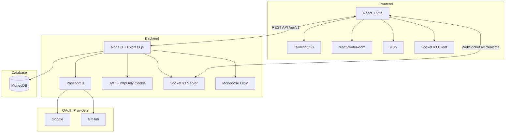
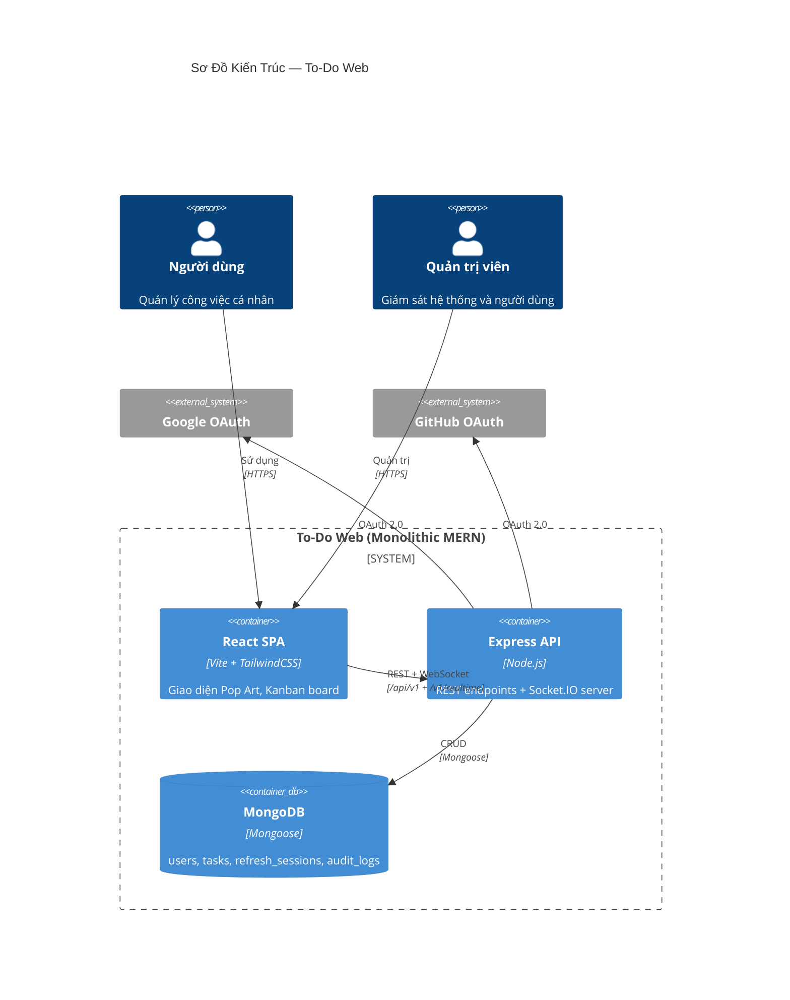

# 00 — Tổng Quan Dự Án

> **Phiên bản:** 1.1 · **Cập nhật lần cuối:** 2026-04-03 · **Trạng thái:** Đang phát triển

---

## 1. Giới Thiệu

**To-Do Web** là ứng dụng quản lý công việc mã nguồn mở, trực quan hóa quy trình làm việc dưới dạng bảng Kanban. Thiết kế lấy cảm hứng từ phong cách **Pop Art** năng động, mang lại trải nghiệm tương tác cao với cập nhật dữ liệu thời gian thực (Realtime).

### 1.1 Mục tiêu

| Mục tiêu | Mô tả |
|-----------|-------|
| **Quản lý công việc** | Tạo, phân loại, theo dõi tiến độ task qua bảng Kanban (Todo → Doing → Done) |
| **Bảo mật đa kênh** | Hỗ trợ xác thực cục bộ (Email/Password) và Social OAuth (Google, GitHub) |
| **Realtime** | Đồng bộ dữ liệu tức thì qua Socket.IO cho mọi thiết bị đăng nhập cùng lúc |
| **Phân quyền** | RBAC (Role-Based Access Control) với 2 vai trò: `user` và `admin` |
| **Đa ngôn ngữ** | Hỗ trợ Tiếng Việt (chính) và Tiếng Anh thông qua i18n |

### 1.2 Phạm vi

Ứng dụng phục vụ cá nhân hoặc nhóm nhỏ quản lý công việc hàng ngày. Kiến trúc ban đầu là Single-tenant, thiết kế schema độc lập để mở rộng Multi-tenant trong tương lai.

---

## 2. Tech Stack

| Tầng | Công nghệ | Vai trò |
|------|-----------|---------|
| **Frontend** | React, Vite, TailwindCSS | SPA với Hot Module Replacement, styling theo Brand Guideline |
| **Routing** | react-router-dom | Điều hướng SPA + Route Guards bảo vệ trang yêu cầu đăng nhập |
| **Backend** | Node.js, Express.js | REST API server, middleware xác thực, xử lý business logic theo pattern MVVM (Model-View-ViewModel) |
| **Database** | MongoDB, Mongoose | Lưu trữ NoSQL, schema validation qua Mongoose ODM |
| **Authentication** | Passport.js, JWT, bcrypt | OAuth (Google/GitHub), JWT access/refresh token, password hashing |
| **Realtime** | Socket.IO | Đồng bộ dữ liệu bidirectional, namespace & room-based |
| **Đa ngôn ngữ** | i18n | Hỗ trợ chuyển đổi VI/EN runtime |

---

## 3. Sơ Đồ Kiến Trúc Tổng Quan

> Xem chi tiết kiến trúc tại → [05-kien-truc-he-thong.md](./05-kien-truc-he-thong.md)

---

## 4. Bảng Thuật Ngữ (Glossary)

Các thuật ngữ dưới đây được sử dụng **nhất quán** trong toàn bộ hệ thống documentation.

| Thuật ngữ | Định nghĩa | Tham chiếu |
|-----------|-------------|------------|
| **Soft-delete** | Cơ chế xóa mềm: gán `deletedAt` timestamp thay vì xóa vật lý. Dữ liệu có thể khôi phục trong 7 ngày. | [ADR-001](./07-architectural-decisions.md#adr-001) |
| **Full Refetch** | Chiến lược đồng bộ client: khi nhận Socket.IO event, client gọi API lấy lại toàn bộ dữ liệu thay vì patch state cục bộ. | [ADR-002](./07-architectural-decisions.md#adr-002) |
| **OAuth Auto-link** | Khi đăng nhập OAuth, nếu email đã tồn tại trong hệ thống → tự động liên kết tài khoản + hiển thị toast cảnh báo. | [ADR-003](./07-architectural-decisions.md#adr-003) |
| **Kanban Board** | Bảng quản lý công việc chia 3 cột trạng thái: `Todo`, `Doing`, `Done`. Hỗ trợ kéo-thả (drag & drop). | [01-yeu-cau-phan-mem.md](./01-yeu-cau-phan-mem.md) |
| **Pop Art / Comic Offset** | Phong cách thiết kế giao diện: viền đen nét `3px`, bóng đổ lệch, màu sắc tương phản cao. | [04a-brand-guideline.md](./04a-brand-guideline.md) |
| **RBAC** | Role-Based Access Control — Phân quyền dựa trên vai trò: `user` hoặc `admin`. | [03-thiet-ke-api.md](./03-thiet-ke-api.md) |
| **Design Tokens** | Bộ biến thiết kế chuẩn (màu sắc, font, spacing, shadow) dùng thống nhất trong toàn bộ UI. | [04a-brand-guideline.md](./04a-brand-guideline.md) |
| **TTL Index** | Time-To-Live index trong MongoDB — tự động xóa document sau khoảng thời gian quy định. | [02-thiet-ke-csdl.md](./02-thiet-ke-csdl.md) |
| **Route Guard** | Middleware frontend kiểm tra trạng thái đăng nhập trước khi cho phép truy cập route. | [05-kien-truc-he-thong.md](./05-kien-truc-he-thong.md) |
| **ViewModel** | Trong MVVM pattern, lớp chứa toàn bộ business logic, validation, và data transformation. Routes chỉ là thin binding layer gọi ViewModel. | [ADR-006](./07-architectural-decisions.md#adr-006) |
| **Purge** | Xóa vĩnh viễn dữ liệu đã soft-delete khi quá hạn khôi phục (> 7 ngày). Thực hiện bởi cron job. | [ADR-001](./07-architectural-decisions.md#adr-001) |

---

## 5. Bản Đồ Tài Liệu (Documentation Map)

| # | Tài liệu | Nội dung chính | Đối tượng |
|---|----------|---------------|-----------|
| 00 | [Tổng Quan](./00-tong-quan.md) | Overview, Tech Stack, Glossary | Tất cả |
| 01 | [Yêu Cầu Phần Mềm](./01-yeu-cau-phan-mem.md) | Use-case Diagram, User Stories, danh sách màn hình | PM, Dev, Giảng viên |
| 02 | [Thiết Kế CSDL](./02-thiet-ke-csdl.md) | ERD Diagram, Schema chi tiết, Indexing | Backend Dev |
| 03 | [Thiết Kế API](./03-thiet-ke-api.md) | Swagger-style REST endpoints, Socket.IO events | Backend Dev, Frontend Dev |
| 04a | [Brand Guideline](./04a-brand-guideline.md) | Typography, Color, Iconography, Spacing, Layout | Designer, Frontend Dev |
| 04b | [Implementation Constraints](./04b-implementation-constraints.md) | Quy tắc code UI, component rules | Frontend Dev |
| 05 | [Kiến Trúc Hệ Thống](./05-kien-truc-he-thong.md) | Component Diagram, Sequence Diagrams, Auth/Socket flow | Architect, Dev |
| 06 | [Kế Hoạch Triển Khai](./06-ke-hoach-trien-khai.md) | Roadmap 8 giai đoạn, Deployment strategy | PM, DevOps |
| 07 | [Quyết Định Kiến Trúc](./07-architectural-decisions.md) | ADR Registry (5 quyết định) | Architect, Dev |

---

## 6. Thông Tin Dự Án

| Thông tin | Giá trị |
|-----------|---------|
| **Repository** | [github.com/vanhuy2005/to-do-list](https://github.com/vanhuy2005/to-do-list) |
| **Tác giả** | vanhuy2005 |
| **Môn học** | Công Nghệ Web — Bài giữa kỳ |
| **Kiến trúc** | Monolithic MERN Stack (MVVM pattern) |
| **Deployment** | Node.js serve React static (Single process) |
