# 01 — Yêu Cầu Phần Mềm (SRS)

> **Phiên bản:** 1.0 · **Cập nhật lần cuối:** 2026-03-25 · **Trạng thái:** Đang phát triển

---

## 1. Use-case Diagram

```mermaid
graph TB
    subgraph Actors
        U((Người dùng))
        A((Quản trị viên))
        S((Hệ thống))
    end

    subgraph "Authentication"
        UC1[Đăng ký tài khoản]
        UC2[Đăng nhập cục bộ]
        UC3[Đăng nhập OAuth<br/>Google / GitHub]
        UC4[Quên mật khẩu]
        UC5[Làm mới token<br/>Refresh Token]
        UC6[Đăng xuất]
    end

    subgraph "Quản lý Task"
        UC7[Tạo Task mới]
        UC8[Xem danh sách Task]
        UC9[Xem chi tiết Task]
        UC10[Cập nhật Task]
        UC11[Kéo-thả đổi trạng thái]
        UC12[Xóa mềm Task]
        UC13[Khôi phục Task]
        UC14[Tìm kiếm Task]
        UC15[Lọc Task nâng cao]
    end

    subgraph "Profile & Settings"
        UC16[Xem / Sửa Profile]
        UC17[Quản lý Sessions]
        UC18[Đổi ngôn ngữ / Theme]
        UC19[Xem Audit Log cá nhân]
    end

    subgraph "Admin System"
        UC20[Xem Dashboard thống kê]
        UC21[Quản lý Users]
        UC22[Kiểm duyệt<br/>Moderation]
        UC23[Xem Audit Logs<br/>hệ thống]
        UC24[Quản lý Thùng rác<br/>tài khoản]
        UC25[Trang Phân tích<br/>Analyze]
        UC26[Thêm User mới]
        UC27[Ban / Disable User]
    end

    subgraph "Hệ thống tự động"
        UC28[Phát Socket.IO event]
        UC29[Full Refetch dữ liệu]
        UC30[Cron job Purge<br/>dữ liệu quá hạn]
        UC31[TTL tự xóa<br/>Audit Logs 30 ngày]
    end

    U --> UC1
    U --> UC2
    U --> UC3
    U --> UC4
    U --> UC6
    U --> UC7
    U --> UC8
    U --> UC9
    U --> UC10
    U --> UC11
    U --> UC12
    U --> UC13
    U --> UC14
    U --> UC15
    U --> UC16
    U --> UC17
    U --> UC18
    U --> UC19

    A --> UC20
    A --> UC21
    A --> UC22
    A --> UC23
    A --> UC24
    A --> UC25
    A --> UC26
    A --> UC27
    A --> UC8
    A --> UC9

    S --> UC5
    S --> UC28
    S --> UC29
    S --> UC30
    S --> UC31

    UC3 -.->|include| UC5
    UC7 -.->|trigger| UC28
    UC10 -.->|trigger| UC28
    UC12 -.->|trigger| UC28
    UC28 -.->|trigger| UC29
```

---

## 2. User Stories

### 2.1 Authentication

| ID | Vai trò | User Story | Tiêu chí chấp nhận |
|----|---------|------------|---------------------|
| US-01 | Người dùng | Là người dùng, tôi muốn **đăng ký bằng email** để tạo tài khoản cá nhân. | Form yêu cầu: displayName, email, password, confirm password. Hiển thị Strength Hint cho mật khẩu. |
| US-02 | Người dùng | Là người dùng, tôi muốn **đăng nhập bằng email/password** để truy cập task của mình. | Trả về JWT access token + httpOnly refresh cookie. |
| US-03 | Người dùng | Là người dùng, tôi muốn **đăng nhập nhanh bằng Google/GitHub** để không cần nhớ mật khẩu. | Redirect OAuth → callback → auto-link nếu email đã tồn tại (kèm toast warning). → Xem [ADR-003](./07-architectural-decisions.md#adr-003) |
| US-04 | Người dùng | Là người dùng, tôi muốn **khôi phục mật khẩu** khi quên. | Form nhập email → gửi link reset → trang đặt password mới. |
| US-05 | Người dùng | Là người dùng, tôi muốn **đăng xuất** an toàn. | Revoke refresh session + xóa cookie + redirect về trang Login. |

### 2.2 Quản lý Task

| ID | Vai trò | User Story | Tiêu chí chấp nhận |
|----|---------|------------|---------------------|
| US-06 | Người dùng | Là người dùng, tôi muốn **tạo task mới** nhanh qua Modal. | Quick Add Modal (không redirect page). Nhập: title, description, status, priority, tags, dueDate. |
| US-07 | Người dùng | Là người dùng, tôi muốn **xem task dạng danh sách** với bộ đếm trạng thái. | Home hiển thị: Status Counters (Todo/Doing/Done) + danh sách Task Cards. |
| US-08 | Người dùng | Là người dùng, tôi muốn **kéo-thả task** giữa các cột Kanban. | Drag & drop cập nhật `status` + `orderIndex`. Broadcast Socket.IO event. |
| US-09 | Người dùng | Là người dùng, tôi muốn **tìm kiếm task** bằng từ khóa. | Search bar toggle, kết quả hiển thị dạng Result Cards. Full-text search trên `title` + `description`. |
| US-10 | Người dùng | Là người dùng, tôi muốn **lọc task** theo nhiều tiêu chí. | Bộ lọc: Status (multi-select), Priority, Tags, Due Date range, Sort (nhiều options). |
| US-11 | Người dùng | Là người dùng, tôi muốn **xem chi tiết task** trong drawer. | Bottom Drawer (~70vh): title, tags, badges (status + priority), due date, description (checklist). |
| US-12 | Người dùng | Là người dùng, tôi muốn **xóa task** với khả năng khôi phục. | Soft-delete (`deletedAt`). Khôi phục trong 7 ngày qua Delete Panel. → Xem [ADR-001](./07-architectural-decisions.md#adr-001) |
| US-13 | Người dùng | Là người dùng, tôi muốn **đánh dấu task quá hạn** thủ công. | Trường `explicitOverdue` cho phép user tự gắn nhãn overdue. |

### 2.3 Profile & Settings

| ID | Vai trò | User Story | Tiêu chí chấp nhận |
|----|---------|------------|---------------------|
| US-14 | Người dùng | Là người dùng, tôi muốn **xem và sửa profile** của mình. | Hiển thị: avatar, displayName, email, stats dashboard (3 metrics). Sửa được: displayName, avatar. |
| US-15 | Người dùng | Là người dùng, tôi muốn **quản lý sessions** đang đăng nhập. | Danh sách thiết bị với khả năng đăng xuất từng thiết bị. |
| US-16 | Người dùng | Là người dùng, tôi muốn **đổi ngôn ngữ và theme**. | Settings: Language (VI/EN), Theme section, Sync & Data, Danger Zone (xóa tài khoản). |
| US-17 | Người dùng | Là người dùng, tôi muốn **xem lịch sử hoạt động** của mình. | Audit Log: Timeline theo nhóm ngày (Hôm nay, Hôm qua). Event Cards với chi tiết hành động. |

### 2.4 Admin System

| ID | Vai trò | User Story | Tiêu chí chấp nhận |
|----|---------|------------|---------------------|
| US-18 | Admin | Là admin, tôi muốn **xem tổng quan hệ thống** trên dashboard. | Stat Cards (2 metrics) + Menu Grid 4 ô: Moderation, Audit, Settings, Trash. |
| US-19 | Admin | Là admin, tôi muốn **kiểm duyệt tài khoản** không hoạt động. | Trang Moderation: Danh sách user không online > 30 ngày → Nút vô hiệu hóa tài khoản. |
| US-20 | Admin | Là admin, tôi muốn **xem log hệ thống** để giám sát. | Trang Audit: Timeline các event hệ thống, before/after snapshots. TTL 30 ngày. |
| US-21 | Admin | Là admin, tôi muốn **quản lý tài khoản bị ban/xóa**. | Trang Trash: Danh sách tài khoản đã bị ban hoặc disabled. Cho phép khôi phục. |
| US-22 | Admin | Là admin, tôi muốn **phân tích dữ liệu** hệ thống. | Trang Analyze: Biểu đồ User Growth Trend, Task Distribution (pie chart), Provider Usage (bar chart). |
| US-23 | Admin | Là admin, tôi muốn **quản lý danh sách người dùng**. | Users Screen: User Cards, Search, Filter Chips (Role/Status), Pagination, Filter User Modal. |
| US-24 | Admin | Là admin, tôi muốn **xem chi tiết và chỉnh sửa user**. | Detailed User Modal: Profile info, Email Card, Work Done stats, Action Buttons (Ban/Disable/Chỉnh quyền). |
| US-25 | Admin | Là admin, tôi muốn **thêm user mới** vào hệ thống. | Add User Modal: Form nhập displayName, email, role (dropdown), password. |

---

## 3. Danh Sách Màn Hình (Tóm Tắt Từ Figma)

> Nguồn: Figma design file, tóm tắt cấu trúc qua Figma API.

### 3.1 Authentication Flow (5 màn hình)

| # | Màn hình | Mô tả | Thành phần chính |
|---|----------|-------|------------------|
| 1 | **Splash Screen** | Màn hình chào mừng, điều hướng đăng nhập | Logo Section (Pop Art), Button CTA, Link phụ |
| 2 | **Register Page** | Đăng ký tài khoản mới | Form (Display Name, Email, Password + Strength Hint, Confirm Password), OAuth Buttons (Google/GitHub), Switch to Login |
| 3 | **Login Screen** | Đăng nhập tài khoản | Form (Email, Password + show/hide), Forgot Password link, OAuth Buttons, Divider |
| 4 | **Forgot Password** | Khôi phục mật khẩu | Form (Email input), Submit Button, Success State Variant, Back to Login link |
| 5 | **Account Existed Fallback** | Xử lý trùng OAuth | Hero Illustration, Message, Account Card (hiển thị account đã tồn tại), Action Bar (Link/Cancel) |

### 3.2 User Flow (9 màn hình)

| # | Màn hình | Mô tả | Thành phần chính |
|---|----------|-------|------------------|
| 1 | **Home Screen** | Trang chủ danh sách task | Status Counters (3 badges), Section Title, Task List (Task Items với badges + action button), FAB "Tạo Task" |
| 2 | **Search Bar Toggle** | Tìm kiếm task | Search Input Field, Results Summary Header, Search Result Cards, Results Footer |
| 3 | **Filter Screen** | Lọc task nâng cao | Status Multi-select, Priority Selector (3 radio), Tags Input, Due Date Range (2 date pickers), Sort Selector, Footer Actions (Reset/Apply) |
| 4 | **Detailed Screen** | Chi tiết task (Drawer) | Header (Title + Close), Task Title & Tag Block, Badges (Status + Priority), Due Date, Description/Checklist, Footer Actions (Edit/Delete/Share icons) |
| 5 | **Patch Tasks Screen** | Chỉnh sửa task | Header (Title + Close), Title Input, Description Textarea, Status & Priority dropdowns, Tags System (chips + add button), Deadline picker, Save/Cancel buttons |
| 6 | **Add Task Screen** | Tạo task mới | Title Input, Description Textarea, Status dropdown + Deadline picker, Priority (3 radio buttons), Tags Section (chips), Submit Button |
| 7 | **Audit Log Screen** | Lịch sử hoạt động | Timeline Section: Today Group + Yesterday Group, Event Cards (icon + description + timestamp + action link), Load More |
| 8 | **Profile Screen** | Hồ sơ cá nhân | Hero Background, Avatar (+ edit button), Identity (Name + role badge), Stats Dashboard (3 metrics), Info Section (3 fields), Account Sections (linked accounts), Logout Button |
| 9 | **Settings Screen** | Cài đặt ứng dụng | Language Section (VI/EN radio), Theme Section (2 options), Security Section (2 links + toggle), Sync & Data Section (toggle + link), Danger Zone (delete account button) |

### 3.3 Admin Flow (3 màn hình + 3 sub-pages)

| # | Màn hình | Mô tả | Thành phần chính |
|---|----------|-------|------------------|
| 1 | **Admin Home** | Dashboard quản trị | Header App Bar, Stats Section (2 Stat Cards), Menu Grid (Moderation / Audit / Settings / Trash) |
| 1a | ↳ **Moderation** | Kiểm duyệt tài khoản | Danh sách user offline > 30 ngày, nút Vô hiệu hóa |
| 1b | ↳ **Audit** | Log hệ thống | Timeline events, Before/After JSON snapshots |
| 1c | ↳ **Trash** | Thùng rác tài khoản | Danh sách user bị ban/xóa, nút Khôi phục |
| 2 | **Analyze Screen** | Phân tích dữ liệu | Filter & Export buttons, User Growth Trend Chart, Task Distribution (pie), Provider Usage (bar chart) |
| 3 | **Users Screen** | Quản lý người dùng | Search bar, Filter Chips (All/Active/Disabled), User Cards (4 items mẫu), Pagination (6 buttons), Sort buttons |

### 3.4 Pop-up / Modal (7 loại)

| # | Modal | Mô tả | Thành phần chính |
|---|-------|-------|------------------|
| 1 | **Warning Modal** | Cảnh báo hành động nguy hiểm | Halftone Header Decor, Title + Message, Input Reason (textarea), CTA Buttons (Confirm/Cancel) |
| 2 | **404 Page** | Trang không tìm thấy | Explosion Bubble icon, Error Title, Error Message, Action Button (Go Home), Footer Text |
| 3 | **Confirm Modal** | Xác nhận hành động | Comic Header (icon + title), Comic Panel Image, Text Content, Buttons Grid (2 actions) |
| 4 | **Toast** | Thông báo nhanh | Checkmark Icon, Success Message (title + subtitle), Close Button |
| 5 | **Filter User Modal** | Lọc danh sách user (Admin) | TopAppBar, Role Section (3 buttons), Status Section (3 radio labels), Date Section (2 date pickers), Action Buttons |
| 6 | **Add User Modal** | Thêm user mới (Admin) | Modal Header (Close + title), Form: Display Name, Email, Role (dropdown), Password, Submit Button |
| 7 | **Detailed User Modal** | Chi tiết user (Admin) | Header (back + title), Profile Info (avatar + name + role badge), Detail Cards (Email, Work Done ×2), Action Buttons |

### 3.5 Shared Components

| Component | Mô tả | Sử dụng tại |
|-----------|-------|-------------|
| **Header - App Bar** | Thanh tiêu đề trên cùng, comic offset shadow, action buttons | Tất cả màn hình |
| **Bottom Navigation Bar** | Thanh điều hướng dưới cùng, 5 links (Home, Filter, FAB, Audit, Profile) | User Flow |
| **Bottom Navigation (Admin)** | Thanh điều hướng admin, 3 links | Admin Flow |
| **Footer Actions** | Thanh action buttons cố định dưới cùng | Filter Screen |

---

## 4. Yêu Cầu Phi Chức Năng

| Hạng mục | Yêu cầu | Chi tiết |
|----------|---------|----------|
| **Performance** | Thời gian tải trang | First Contentful Paint < 2s trên 4G |
| **Performance** | Kích thước bundle | Tối ưu qua Vite tree-shaking + code splitting |
| **Security** | Lưu trữ token | Access token trong memory, Refresh token trong httpOnly cookie |
| **Security** | Hash password | bcrypt cho password và refresh token |
| **Security** | Input validation | Server-side validation mọi endpoint, sanitize input |
| **Accessibility** | Touch target | Tối thiểu 44×44px cho mọi interactive element |
| **Accessibility** | Focus indicator | 2px Cyan (#00C2FF) offset ring |
| **Accessibility** | Keyboard navigation | Tab order hợp lý, Enter/Space kích hoạt action |
| **i18n** | Đa ngôn ngữ | Tiếng Việt (mặc định) + Tiếng Anh |
| **Responsive** | Mobile-first | Breakpoints: 390px (mobile) → 768px (tablet) |
| **UX** | State management | Mọi list/form phải có 4 trạng thái: loading, empty, error, ready |
| **UX** | Animation | 150-220ms transitions, cubic-bezier(0.2, 0.8, 0.2, 1) |

---

> **Tham chiếu:**
> - Thiết kế CSDL → [02-thiet-ke-csdl.md](./02-thiet-ke-csdl.md)
> - Đặc tả API → [03-thiet-ke-api.md](./03-thiet-ke-api.md)
> - Thiết kế giao diện → [04a-brand-guideline.md](./04a-brand-guideline.md)
> - Kiến trúc hệ thống → [05-kien-truc-he-thong.md](./05-kien-truc-he-thong.md)
