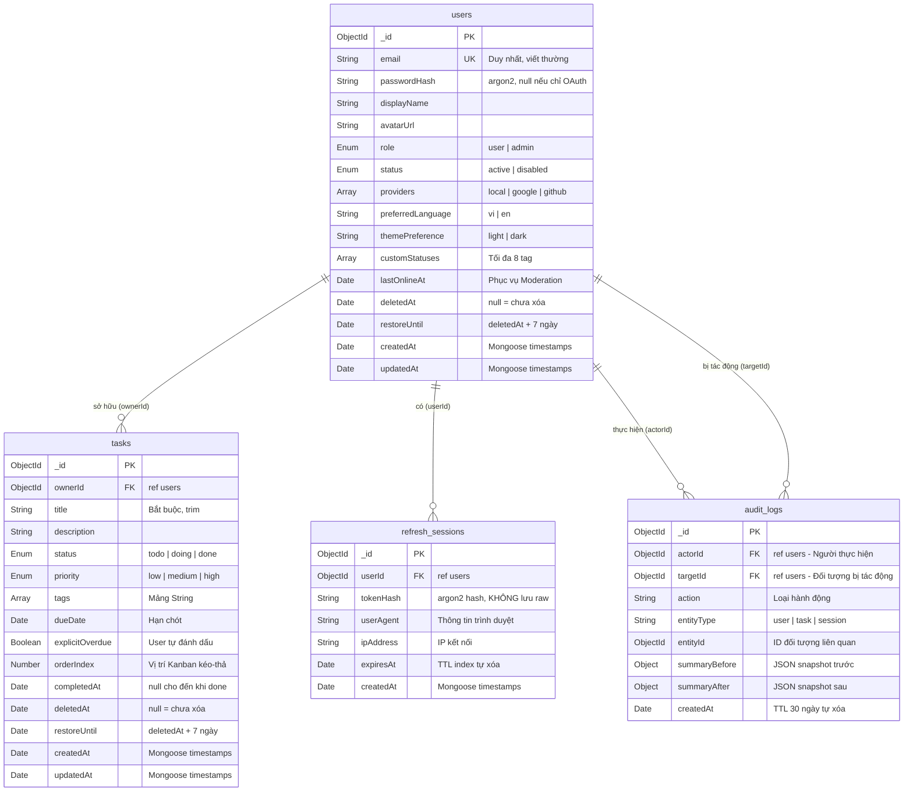

# 02 — Thiết Kế Cơ Sở Dữ Liệu

> **Phiên bản:** 1.0 · **Cập nhật lần cuối:** 2026-03-25 · **Database:** MongoDB + Mongoose ODM

---

## 1. ERD Diagram

---

## 2. Chi Tiết Từng Collection

### 2.1 Collection `users`

> **Vai trò:** Danh tính người dùng, tùy chỉnh, lịch sử kết nối OAuth.

| Trường | Kiểu | Bắt buộc | Mặc định | Mô tả |
|--------|------|----------|----------|-------|
| `_id` | ObjectId | ✅ | auto | Khóa chính |
| `email` | String | ✅ | — | Unique, luôn lowercase. Index: `{ email: 1 }, { unique: true }` |
| `passwordHash` | String | ❌ | null | Hash bằng argon2. `null` nếu user chỉ đăng ký qua OAuth |
| `displayName` | String | ✅ | — | Tên hiển thị |
| `avatarUrl` | String | ❌ | null | URL ảnh đại diện |
| `role` | Enum | ✅ | `"user"` | `"user"` \| `"admin"` |
| `status` | Enum | ✅ | `"active"` | `"active"` \| `"disabled"` |
| `providers` | [String] | ✅ | `[]` | Danh sách provider đã liên kết: `"local"`, `"google"`, `"github"` |
| `preferredLanguage` | String | ❌ | `"vi"` | `"vi"` \| `"en"` |
| `themePreference` | String | ❌ | `"light"` | `"light"` \| `"dark"` |
| `customStatuses` | [String] | ❌ | `[]` | Tag tùy chỉnh, tối đa 8 phần tử |
| `lastOnlineAt` | Date | ❌ | null | Thời điểm online cuối. Phục vụ trang Moderation (> 30 ngày = cảnh báo) |
| `deletedAt` | Date | ❌ | null | Soft-delete timestamp. → [ADR-001](./07-architectural-decisions.md#adr-001) |
| `restoreUntil` | Date | ❌ | null | `deletedAt + 7 ngày`. Quá hạn → cron purge |

### 2.2 Collection `tasks`

> **Vai trò:** Domain object chính — thẻ công việc trên bảng Kanban.

| Trường | Kiểu | Bắt buộc | Mặc định | Mô tả |
|--------|------|----------|----------|-------|
| `_id` | ObjectId | ✅ | auto | Khóa chính |
| `ownerId` | ObjectId | ✅ | — | FK → `users._id`. User sở hữu task (chỉ owner + admin xem được) |
| `title` | String | ✅ | — | Tiêu đề task, `trim: true` |
| `description` | String | ❌ | `""` | Mô tả chi tiết |
| `status` | Enum | ✅ | `"todo"` | `"todo"` \| `"doing"` \| `"done"` |
| `priority` | Enum | ❌ | `"medium"` | `"low"` \| `"medium"` \| `"high"` |
| `tags` | [String] | ❌ | `[]` | Nhãn phân loại |
| `dueDate` | Date | ❌ | null | Hạn chót. Overdue = `dueDate < now && status ≠ done` (frontend tính) |
| `explicitOverdue` | Boolean | ❌ | `false` | User tự tay đánh dấu quá hạn |
| `orderIndex` | Number | ❌ | 0 | Vị trí sắp xếp trong cột Kanban (cập nhật khi kéo-thả) |
| `completedAt` | Date | ❌ | null | Gán khi `status` chuyển sang `"done"` |
| `deletedAt` | Date | ❌ | null | Soft-delete. → [ADR-001](./07-architectural-decisions.md#adr-001) |
| `restoreUntil` | Date | ❌ | null | `deletedAt + 7 ngày` |

### 2.3 Collection `refresh_sessions`

> **Vai trò:** Quản lý phiên đăng nhập bảo mật. Mỗi thiết bị = 1 session.

| Trường | Kiểu | Bắt buộc | Mặc định | Mô tả |
|--------|------|----------|----------|-------|
| `_id` | ObjectId | ✅ | auto | Khóa chính |
| `userId` | ObjectId | ✅ | — | FK → `users._id` |
| `tokenHash` | String | ✅ | — | Hash bằng argon2. **TUYỆT ĐỐI** không lưu raw token |
| `userAgent` | String | ❌ | — | Browser/device info |
| `ipAddress` | String | ❌ | — | IP address kết nối |
| `expiresAt` | Date | ✅ | — | TTL index tự xóa khi hết hạn |

### 2.4 Collection `audit_logs`

> **Vai trò:** Nhật ký kiểm toán — lưu hành động Admin và thay đổi hệ thống.

| Trường | Kiểu | Bắt buộc | Mặc định | Mô tả |
|--------|------|----------|----------|-------|
| `_id` | ObjectId | ✅ | auto | Khóa chính |
| `actorId` | ObjectId | ✅ | — | FK → `users._id`. Người thực hiện hành động |
| `targetId` | ObjectId | ❌ | null | FK → `users._id`. Đối tượng bị tác động (nếu có) |
| `action` | String | ✅ | — | Loại hành động: `"user.disabled"`, `"task.deleted"`, `"user.role_changed"`,... |
| `entityType` | String | ✅ | — | `"user"` \| `"task"` \| `"session"` |
| `entityId` | ObjectId | ✅ | — | ID của entity bị tác động |
| `summaryBefore` | Object | ❌ | `{}` | JSON snapshot trạng thái trước thay đổi |
| `summaryAfter` | Object | ❌ | `{}` | JSON snapshot trạng thái sau thay đổi |
| `createdAt` | Date | ✅ | auto | TTL 30 ngày → tự động xóa |

---

## 3. Chiến Lược Chỉ Mục (Indexing Strategy)

| Collection | Index | Loại | Mục đích |
|------------|-------|------|----------|
| `users` | `{ email: 1 }` | Unique | Đảm bảo email không trùng lặp, tăng tốc lookup đăng nhập |
| `tasks` | `{ ownerId: 1, status: 1, dueDate: 1, updatedAt: -1 }` | Compound | Tối ưu truy vấn bảng Kanban: lọc theo owner + status, sắp xếp theo due date và update time |
| `tasks` | `{ title: "text", description: "text" }` | Text | Full-text search tìm kiếm task |
| `refresh_sessions` | `{ expiresAt: 1 }` | TTL | Tự động xóa session hết hạn |
| `audit_logs` | `{ createdAt: 1 }` | TTL (30 ngày) | `expireAfterSeconds: 2592000`. Tự động dọn dẹp log cũ |
| `audit_logs` | `{ actorId: 1, createdAt: -1 }` | Compound | Truy vấn log theo người thực hiện, sắp xếp mới nhất |

**Lưu ý Migration:**
> Mọi index trên môi trường production phải được deploy qua Migration Scripts lên MongoDB Cluster **trước khi** rollout tính năng mới.

---

## 4. Quy Tắc Dữ Liệu

| Quy tắc | Chi tiết | Tham chiếu |
|---------|----------|------------|
| **Timezone** | DB lưu 100% UTC. Frontend chịu trách nhiệm convert theo timezone thiết bị. | [ADR-005](./07-architectural-decisions.md#adr-005) |
| **Soft-delete** | Mọi delete đều gán `deletedAt`. Cron job quét `restoreUntil` quá hạn → purge. | [ADR-001](./07-architectural-decisions.md#adr-001) |
| **Token Security** | `tokenHash` trong `refresh_sessions` luôn hash bằng argon2. Cấm lưu raw token. | [05-kien-truc-he-thong.md](./05-kien-truc-he-thong.md) |
| **Tenancy** | Single-tenant v1. Schema thiết kế độc lập để mở rộng multi-tenant trong tương lai. | [ADR-004](./07-architectural-decisions.md#adr-004) |

---

> **Tham chiếu:**
> - Đặc tả API sử dụng schema này → [03-thiet-ke-api.md](./03-thiet-ke-api.md)
> - Quyết định kiến trúc liên quan → [07-architectural-decisions.md](./07-architectural-decisions.md)
