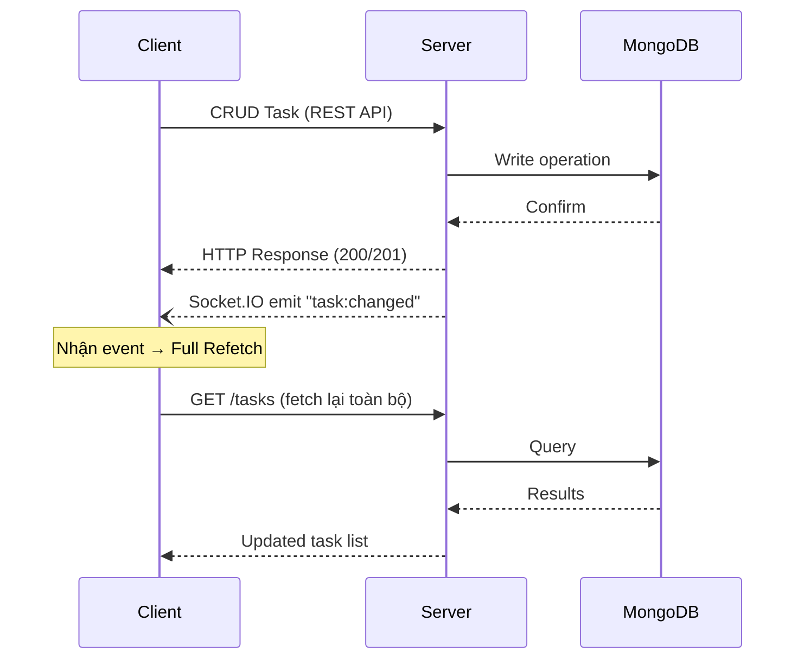

# 03 — Đặc Tả API

> **Phiên bản:** 1.0 · **Cập nhật lần cuối:** 2026-03-25 · **Base URL:** `/api/v1`

---

## 1. Tổng Quan

- **Giao thức:** REST over HTTPS
- **Format:** JSON (`Content-Type: application/json`)
- **Xác thực:** Bearer Token (JWT) trong header `Authorization`
- **Realtime:** Socket.IO namespace `/v1/realtime`
- **Phân quyền:** RBAC — `user` và `admin`

### Quy ước Response

```json
// Thành công
{
  "success": true,
  "data": { ... },
  "message": "Mô tả kết quả"
}

// Lỗi
{
  "success": false,
  "error": {
    "code": "ERROR_CODE",
    "message": "Mô tả lỗi"
  }
}
```

### Mã Trạng Thái HTTP

| Code | Ý nghĩa |
|------|---------|
| `200` | OK — Thành công |
| `201` | Created — Tạo mới thành công |
| `400` | Bad Request — Dữ liệu đầu vào không hợp lệ |
| `401` | Unauthorized — Chưa đăng nhập hoặc token hết hạn |
| `403` | Forbidden — Không có quyền truy cập |
| `404` | Not Found — Tài nguyên không tồn tại |
| `409` | Conflict — Xung đột dữ liệu (email đã tồn tại) |
| `500` | Internal Server Error — Lỗi hệ thống |

---

## 2. Authentication & Profile

### 2.1 Đăng ký

```yaml
POST /auth/register
```

| Thông tin | Giá trị |
|-----------|---------|
| **Mô tả** | Đăng ký người dùng cục bộ mới |
| **Xác thực** | Không yêu cầu |

**Request Body:**

| Trường | Kiểu | Bắt buộc | Validation | Mô tả |
|--------|------|----------|------------|-------|
| `email` | String | ✅ | Email hợp lệ, lowercase | Địa chỉ email |
| `password` | String | ✅ | Tối thiểu 8 ký tự | Mật khẩu |
| `displayName` | String | ✅ | 2-50 ký tự | Tên hiển thị |

**Response `201 Created`:**

```json
{
  "success": true,
  "data": {
    "accessToken": "eyJhbGciOiJIUzI1NiIs...",
    "user": {
      "id": "665a1b2c3d4e5f6a7b8c9d0e",
      "email": "user@example.com",
      "displayName": "Nguyễn Văn A",
      "role": "user",
      "status": "active",
      "providers": ["local"]
    }
  }
}
```

**Cookie:** `refreshToken` (httpOnly, Secure, SameSite=Strict)

**Response `409 Conflict`:**

```json
{
  "success": false,
  "error": {
    "code": "EMAIL_EXISTS",
    "message": "Email đã được đăng ký trong hệ thống"
  }
}
```

---

### 2.2 Đăng nhập

```yaml
POST /auth/login
```

| Thông tin | Giá trị |
|-----------|---------|
| **Mô tả** | Đăng nhập bằng email và mật khẩu |
| **Xác thực** | Không yêu cầu |

**Request Body:**

| Trường | Kiểu | Bắt buộc | Mô tả |
|--------|------|----------|-------|
| `email` | String | ✅ | Địa chỉ email |
| `password` | String | ✅ | Mật khẩu |

**Response `200 OK`:**

```json
{
  "success": true,
  "data": {
    "accessToken": "eyJhbGciOiJIUzI1NiIs...",
    "user": {
      "id": "665a1b2c3d4e5f6a7b8c9d0e",
      "email": "user@example.com",
      "displayName": "Nguyễn Văn A",
      "role": "user",
      "status": "active",
      "providers": ["local", "google"]
    }
  }
}
```

**Cookie:** `refreshToken` (httpOnly)

**Response `401 Unauthorized`:**

```json
{
  "success": false,
  "error": {
    "code": "INVALID_CREDENTIALS",
    "message": "Email hoặc mật khẩu không đúng"
  }
}
```

---

### 2.3 Làm mới Token

```yaml
POST /auth/refresh
```

| Thông tin | Giá trị |
|-----------|---------|
| **Mô tả** | Xin cấp lại access token dựa vào refresh session hiện tại |
| **Xác thực** | Cookie `refreshToken` |

**Request:** Không có body — đọc token từ httpOnly cookie.

**Response `200 OK`:**

```json
{
  "success": true,
  "data": {
    "accessToken": "eyJhbGciOiJIUzI1NiIs..."
  }
}
```

**Response `401 Unauthorized`:**

```json
{
  "success": false,
  "error": {
    "code": "REFRESH_TOKEN_INVALID",
    "message": "Session hết hạn, vui lòng đăng nhập lại"
  }
}
```

---

### 2.4 Đăng xuất

```yaml
POST /auth/logout
```

| Thông tin | Giá trị |
|-----------|---------|
| **Mô tả** | Vô hiệu hóa refresh session và xóa cookie |
| **Xác thực** | Bearer Token + Cookie `refreshToken` |

**Response `200 OK`:**

```json
{
  "success": true,
  "message": "Đăng xuất thành công"
}
```

---

### 2.5 OAuth

```yaml
GET /auth/google
GET /auth/github
```

| Thông tin | Giá trị |
|-----------|---------|
| **Mô tả** | Kích hoạt quy trình đăng nhập/liên kết qua OAuth |
| **Xác thực** | Không yêu cầu |
| **Hành vi** | Redirect → OAuth Provider → Callback → Auto-link nếu email đã tồn tại (kèm toast warning) → Redirect về SPA với token |

> Xem chi tiết flow: [ADR-003](./07-architectural-decisions.md#adr-003) và [Sequence Diagram](./05-kien-truc-he-thong.md)

---

### 2.6 Xem Profile

```yaml
GET /profile
```

| Thông tin | Giá trị |
|-----------|---------|
| **Mô tả** | Lấy thông tin hồ sơ tài khoản đang đăng nhập |
| **Xác thực** | Bearer Token |

**Response `200 OK`:**

```json
{
  "success": true,
  "data": {
    "id": "665a1b2c3d4e5f6a7b8c9d0e",
    "email": "user@example.com",
    "displayName": "Nguyễn Văn A",
    "avatarUrl": "https://...",
    "role": "user",
    "status": "active",
    "providers": ["local", "google"],
    "preferredLanguage": "vi",
    "themePreference": "light",
    "customStatuses": ["Urgent", "Review"],
    "createdAt": "2026-01-15T10:30:00.000Z"
  }
}
```

---

### 2.7 Cập nhật Profile

```yaml
PUT /profile
```

| Thông tin | Giá trị |
|-----------|---------|
| **Mô tả** | Cập nhật thông tin cơ bản hồ sơ |
| **Xác thực** | Bearer Token |

**Request Body (partial update):**

| Trường | Kiểu | Bắt buộc | Mô tả |
|--------|------|----------|-------|
| `displayName` | String | ❌ | Tên hiển thị mới |
| `preferredLanguage` | Enum | ❌ | `"vi"` \| `"en"` |
| `themePreference` | Enum | ❌ | `"light"` \| `"dark"` |

**Response `200 OK`:**

```json
{
  "success": true,
  "data": { "...updated user object" }
}
```

---

### 2.8 Quản lý Sessions

```yaml
GET /profile/sessions
```

| Thông tin | Giá trị |
|-----------|---------|
| **Mô tả** | Xem danh sách thiết bị đang đăng nhập |
| **Xác thực** | Bearer Token |

**Response `200 OK`:**

```json
{
  "success": true,
  "data": [
    {
      "id": "session_abc123",
      "userAgent": "Chrome 120 / Windows 11",
      "ipAddress": "192.168.1.100",
      "createdAt": "2026-03-20T08:00:00.000Z",
      "isCurrent": true
    }
  ]
}
```

```yaml
DELETE /profile/sessions/:id
```

| Thông tin | Giá trị |
|-----------|---------|
| **Mô tả** | Đăng xuất một thiết bị cụ thể |
| **Xác thực** | Bearer Token |
| **Phân quyền** | Chỉ owner (session phải thuộc user đang đăng nhập) |

**Response `200 OK`:**

```json
{
  "success": true,
  "message": "Đã đăng xuất thiết bị"
}
```

---

## 3. Task Management

### 3.1 Danh sách Task

```yaml
GET /tasks
```

| Thông tin | Giá trị |
|-----------|---------|
| **Mô tả** | Truy vấn danh sách task (chỉ task của user đang đăng nhập, trừ admin) |
| **Xác thực** | Bearer Token |

**Query Parameters:**

| Param | Kiểu | Mặc định | Mô tả |
|-------|------|----------|-------|
| `status` | String | — | Lọc theo status: `todo`, `doing`, `done` (hỗ trợ multi: `todo,doing`) |
| `priority` | String | — | Lọc theo priority: `low`, `medium`, `high` |
| `tags` | String | — | Lọc theo tags (comma-separated) |
| `search` | String | — | Full-text search trên `title` + `description` |
| `dueDateFrom` | ISO Date | — | Lọc task có `dueDate >= giá trị` |
| `dueDateTo` | ISO Date | — | Lọc task có `dueDate <= giá trị` |
| `sort` | String | `updatedAt` | Sắp xếp theo: `dueDate`, `priority`, `createdAt`, `updatedAt` |
| `order` | String | `desc` | `asc` \| `desc` |
| `page` | Number | `1` | Số trang |
| `limit` | Number | `20` | Số lượng mỗi trang (tối đa 100) |
| `includeDeleted` | Boolean | `false` | Bao gồm task đã soft-delete (cho Delete Panel) |

**Response `200 OK`:**

```json
{
  "success": true,
  "data": {
    "tasks": [
      {
        "id": "665b2c3d4e5f6a7b8c9d0e1f",
        "title": "Hoàn thành báo cáo",
        "description": "Viết phần kết luận...",
        "status": "doing",
        "priority": "high",
        "tags": ["urgent", "report"],
        "dueDate": "2026-03-28T17:00:00.000Z",
        "explicitOverdue": false,
        "orderIndex": 2,
        "completedAt": null,
        "deletedAt": null,
        "createdAt": "2026-03-20T09:00:00.000Z",
        "updatedAt": "2026-03-25T14:30:00.000Z"
      }
    ],
    "pagination": {
      "page": 1,
      "limit": 20,
      "total": 45,
      "totalPages": 3
    }
  }
}
```

---

### 3.2 Tạo Task

```yaml
POST /tasks
```

| Thông tin | Giá trị |
|-----------|---------|
| **Mô tả** | Tạo thẻ công việc Kanban mới |
| **Xác thực** | Bearer Token |

**Request Body:**

| Trường | Kiểu | Bắt buộc | Mô tả |
|--------|------|----------|-------|
| `title` | String | ✅ | Tiêu đề (1-200 ký tự) |
| `description` | String | ❌ | Mô tả chi tiết |
| `status` | Enum | ❌ | Mặc định: `"todo"` |
| `priority` | Enum | ❌ | Mặc định: `"medium"` |
| `tags` | [String] | ❌ | Nhãn phân loại |
| `dueDate` | ISO Date | ❌ | Hạn chót |

**Response `201 Created`:**

```json
{
  "success": true,
  "data": { "...task object" },
  "message": "Tạo task thành công"
}
```

**Side effect:** Phát Socket.IO event `task:changed` → [Mục 5](#5-socket-io-events)

---

### 3.3 Chi tiết Task

```yaml
GET /tasks/:id
```

| Thông tin | Giá trị |
|-----------|---------|
| **Mô tả** | Xem chi tiết 1 task |
| **Xác thực** | Bearer Token |
| **Phân quyền** | Owner hoặc Admin |

**Response `200 OK`:**

```json
{
  "success": true,
  "data": { "...full task object" }
}
```

---

### 3.4 Cập nhật Task

```yaml
PUT /tasks/:id
```

| Thông tin | Giá trị |
|-----------|---------|
| **Mô tả** | Sửa thẻ công việc (partial update) |
| **Xác thực** | Bearer Token |
| **Phân quyền** | Owner hoặc Admin |

**Request Body (partial update):**

| Trường | Kiểu | Mô tả |
|--------|------|-------|
| `title` | String | Tiêu đề mới |
| `description` | String | Mô tả mới |
| `status` | Enum | `todo` \| `doing` \| `done` (tự gán `completedAt` nếu `done`) |
| `priority` | Enum | `low` \| `medium` \| `high` |
| `tags` | [String] | Nhãn mới |
| `dueDate` | ISO Date | Hạn chót mới |
| `orderIndex` | Number | Vị trí Kanban (cập nhật khi kéo-thả) |
| `explicitOverdue` | Boolean | Đánh dấu quá hạn thủ công |

**Side effect:** Phát Socket.IO event `task:changed`

---

### 3.5 Xóa mềm Task

```yaml
DELETE /tasks/:id
```

| Thông tin | Giá trị |
|-----------|---------|
| **Mô tả** | Đưa task vào thùng rác (gán `deletedAt` + `restoreUntil`) |
| **Xác thực** | Bearer Token |
| **Phân quyền** | Owner hoặc Admin |

**Response `200 OK`:**

```json
{
  "success": true,
  "message": "Task đã được chuyển vào thùng rác. Có thể khôi phục trong 7 ngày."
}
```

**Side effect:** Phát Socket.IO event `task:changed`

> Xem chính sách Soft-delete: [ADR-001](./07-architectural-decisions.md#adr-001)

---

### 3.6 Khôi phục Task

```yaml
POST /tasks/:id/restore
```

| Thông tin | Giá trị |
|-----------|---------|
| **Mô tả** | Khôi phục task từ thùng rác (trong cửa sổ 7 ngày) |
| **Xác thực** | Bearer Token |
| **Phân quyền** | Owner hoặc Admin |

**Response `200 OK`:**

```json
{
  "success": true,
  "data": { "...restored task object" },
  "message": "Task đã được khôi phục"
}
```

**Response `410 Gone`:**

```json
{
  "success": false,
  "error": {
    "code": "RESTORE_WINDOW_EXPIRED",
    "message": "Task đã quá hạn khôi phục (> 7 ngày)"
  }
}
```

---

## 4. Admin Panel

> **Yêu cầu:** Tất cả endpoint trong mục này yêu cầu `role: "admin"`.

### 4.1 Danh sách Users

```yaml
GET /admin/users
```

**Query Parameters:**

| Param | Kiểu | Mô tả |
|-------|------|-------|
| `search` | String | Tìm theo displayName hoặc email |
| `role` | Enum | `user` \| `admin` |
| `status` | Enum | `active` \| `disabled` |
| `dateFrom` | ISO Date | Lọc theo ngày tạo |
| `dateTo` | ISO Date | Lọc theo ngày tạo |
| `page` | Number | Số trang |
| `limit` | Number | Số lượng mỗi trang |

**Response `200 OK`:**

```json
{
  "success": true,
  "data": {
    "users": [
      {
        "id": "665a1b2c3d4e5f6a7b8c9d0e",
        "email": "tranthib@example.com",
        "displayName": "Trần Thị B",
        "avatarUrl": "https://...",
        "role": "user",
        "status": "active",
        "providers": ["local", "google"],
        "lastOnlineAt": "2026-03-24T15:00:00.000Z",
        "createdAt": "2026-01-10T08:00:00.000Z"
      }
    ],
    "pagination": { "page": 1, "limit": 20, "total": 150, "totalPages": 8 }
  }
}
```

---

### 4.2 Cập nhật User

```yaml
PUT /admin/users/:id
```

**Request Body:**

| Trường | Kiểu | Mô tả |
|--------|------|-------|
| `role` | Enum | Chỉnh quyền: `"user"` \| `"admin"` |
| `status` | Enum | `"active"` \| `"disabled"` |

**Side effect:** Phát Socket.IO event `user:updated`

---

### 4.3 Kiểm duyệt (Moderation)

```yaml
GET /admin/moderation
```

| Thông tin | Giá trị |
|-----------|---------|
| **Mô tả** | Danh sách user không online > 30 ngày |
| **Logic** | `lastOnlineAt < (now - 30 days)` AND `status = "active"` |

**Response `200 OK`:**

```json
{
  "success": true,
  "data": {
    "users": [
      {
        "id": "...",
        "displayName": "Lê Văn C",
        "email": "levanc@example.com",
        "lastOnlineAt": "2026-02-15T10:00:00.000Z",
        "daysSinceLastOnline": 38
      }
    ]
  }
}
```

```yaml
PUT /admin/moderation/:id/disable
```

| Thông tin | Giá trị |
|-----------|---------|
| **Mô tả** | Vô hiệu hóa tài khoản không hoạt động |
| **Hành vi** | Gán `status: "disabled"` + tạo audit log |

---

### 4.4 Thùng rác Tài khoản (Trash)

```yaml
GET /admin/trash
```

| Thông tin | Giá trị |
|-----------|---------|
| **Mô tả** | Danh sách tài khoản đã bị ban hoặc disabled |
| **Logic** | `status = "disabled"` OR `deletedAt != null` |

---

### 4.5 Tasks (Kiểm duyệt nội dung)

```yaml
GET /admin/tasks
```

| Thông tin | Giá trị |
|-----------|---------|
| **Mô tả** | Dashboard đọc nội dung tasks phục vụ moderation |

---

### 4.6 Phân tích (Analytics)

```yaml
GET /admin/analytics
```

| Thông tin | Giá trị |
|-----------|---------|
| **Mô tả** | Số liệu thống kê tổng quan hệ thống |

**Response `200 OK`:**

```json
{
  "success": true,
  "data": {
    "userGrowthTrend": [
      { "date": "2026-03-01", "count": 120 },
      { "date": "2026-03-02", "count": 125 }
    ],
    "taskDistribution": {
      "todo": 234,
      "doing": 156,
      "done": 890
    },
    "providerUsage": {
      "local": 450,
      "google": 380,
      "github": 120
    },
    "totalUsers": 950,
    "totalTasks": 1280
  }
}
```

---

### 4.7 Audit Logs

```yaml
GET /admin/audit-logs
```

| Thông tin | Giá trị |
|-----------|---------|
| **Mô tả** | Nhật ký kiểm toán hệ thống |

**Query Parameters:**

| Param | Kiểu | Mô tả |
|-------|------|-------|
| `actorId` | ObjectId | Lọc theo người thực hiện |
| `action` | String | Lọc theo loại hành động |
| `page` | Number | Số trang |
| `limit` | Number | Số lượng mỗi trang |

**Response `200 OK`:**

```json
{
  "success": true,
  "data": {
    "logs": [
      {
        "id": "...",
        "actorId": "...",
        "actorName": "Admin Nguyễn",
        "action": "user.disabled",
        "entityType": "user",
        "entityId": "...",
        "summaryBefore": { "status": "active" },
        "summaryAfter": { "status": "disabled" },
        "createdAt": "2026-03-25T10:30:00.000Z"
      }
    ],
    "pagination": { "page": 1, "limit": 20, "total": 89, "totalPages": 5 }
  }
}
```

---

## 5. Socket.IO Events

### 5.1 Thiết lập kết nối

```yaml
Namespace: /v1/realtime
Handshake: JWT token trong auth object
```

```javascript
// Client
const socket = io("/v1/realtime", {
  auth: { token: accessToken }
});
```

### 5.2 Phân phòng (Rooms)

| Room | Thành viên | Mô tả |
|------|-----------|-------|
| `user:{userId}` | User cụ thể | Nhận event liên quan đến task/profile của mình |
| `admin-channel` | Tất cả Admin | Nhận event hệ thống, metrics updates |

### 5.3 Events (Server → Client)

| Event | Payload | Trigger | Room |
|-------|---------|---------|------|
| `task:changed` | `{ action: "created"\|"updated"\|"deleted"\|"restored", taskId: "..." }` | Mỗi khi CRUD task được xác nhận | `user:{ownerId}` |
| `user:updated` | `{ userId: "...", changes: ["status", "role"] }` | Admin tác động lên user | `user:{targetUserId}` |
| `admin:metrics-updated` | `{ type: "user_count"\|"task_count", value: 951 }` | Event quan trọng ảnh hưởng dashboard | `admin-channel` |

### 5.4 Chiến Lược Đồng Bộ Client

> Xem chi tiết: [ADR-002 — Full Refetch Strategy](./07-architectural-decisions.md#adr-002)



---

> **Tham chiếu:**
> - Schema dữ liệu → [02-thiet-ke-csdl.md](./02-thiet-ke-csdl.md)
> - Kiến trúc hệ thống → [05-kien-truc-he-thong.md](./05-kien-truc-he-thong.md)
> - Quyết định kiến trúc → [07-architectural-decisions.md](./07-architectural-decisions.md)
