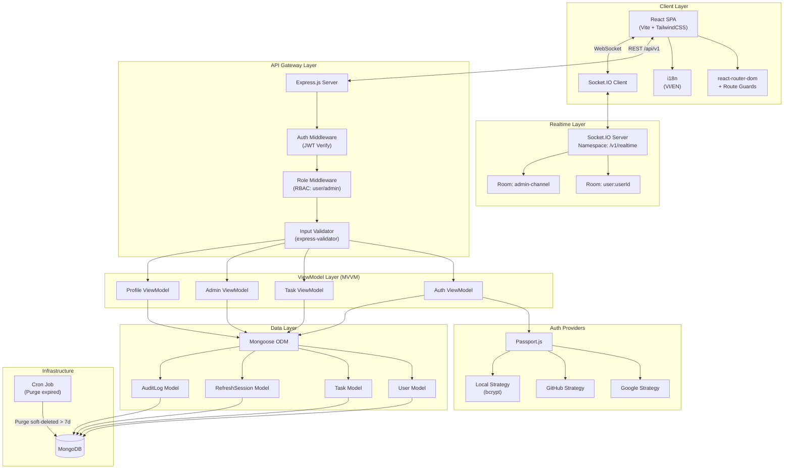
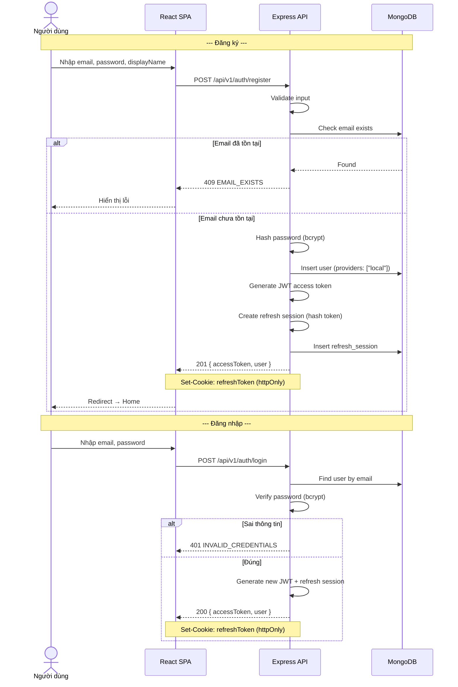
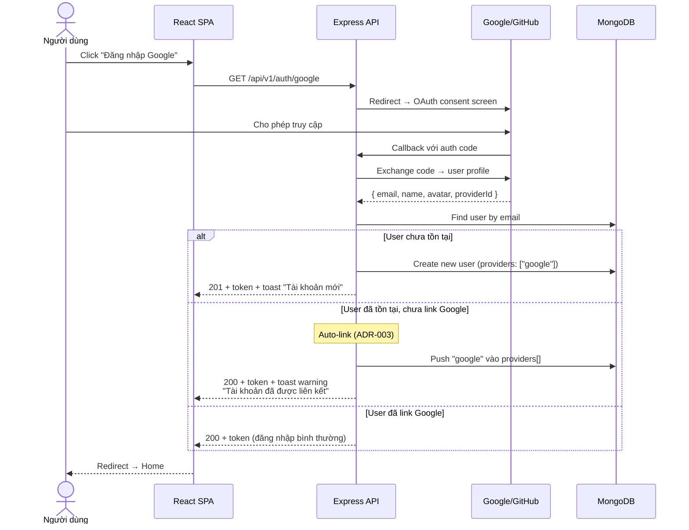
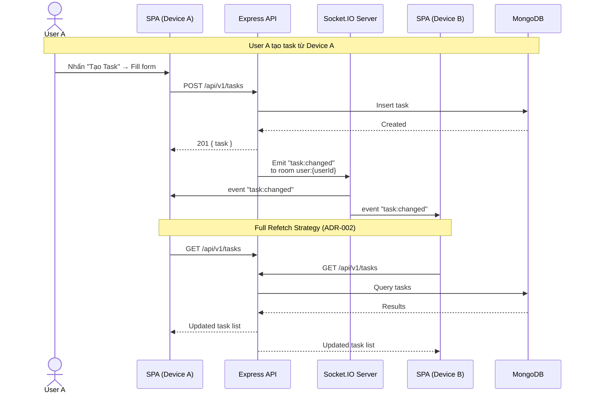
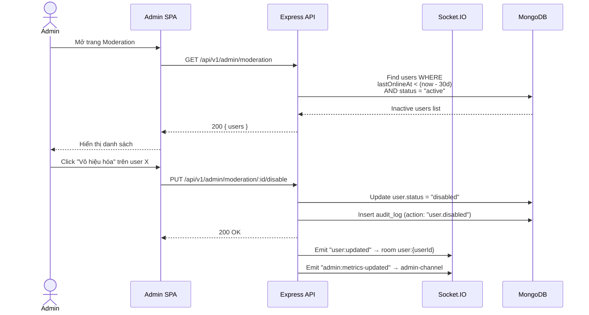
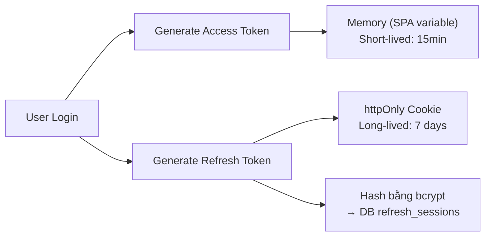
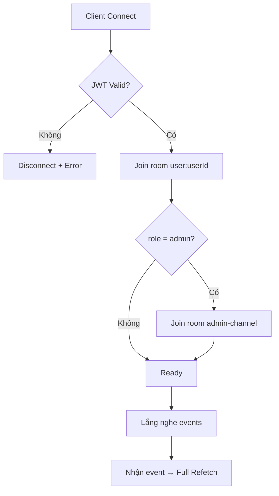

# 05 — Kiến Trúc Hệ Thống

> **Phiên bản:** 1.1 · **Cập nhật lần cuối:** 2026-04-03

---

## 1. Component Diagram

---

## 2. Sequence Diagrams

### 2.1 Đăng ký & Đăng nhập (Local Auth)

### 2.2 OAuth Flow (Google/GitHub)

### 2.3 Task CRUD + Realtime Sync

### 2.4 Admin Moderation Flow

---

## 3. Authentication Architecture

### 3.1 JWT Strategy

| Token | Lưu trữ | TTL | Sử dụng |
|-------|---------|-----|---------|
| **Access Token** | Memory (JS variable) | 15 phút | Header `Authorization: Bearer <token>` |
| **Refresh Token** | httpOnly cookie | 7 ngày | Tự động gửi khi gọi `/auth/refresh` |

### 3.2 Token Rotation

1. Access token hết hạn → SPA interceptor gọi `POST /auth/refresh`
2. Server verify refresh token (compare bcrypt hash)
3. Nếu hợp lệ: issue access token mới + refresh token mới (xóa token cũ)
4. Nếu không hợp lệ: 401 → redirect Login

### 3.3 Multi-device Sessions

- Mỗi login = 1 `refresh_session` record
- User xem danh sách sessions tại `GET /profile/sessions`
- User xóa session cụ thể tại `DELETE /profile/sessions/:id`
- TTL index trên `expiresAt` → tự động dọn session hết hạn

---

## 4. Realtime Architecture (Socket.IO)

### 4.1 Connection Lifecycle

### 4.2 Event Flow

| Trigger | Event | Target Room | Client Action |
|---------|-------|-------------|---------------|
| CRUD Task | `task:changed` | `user:{ownerId}` | Fetch lại `/tasks` |
| Admin thay đổi user | `user:updated` | `user:{targetUserId}` | Fetch lại `/profile` |
| Event hệ thống quan trọng | `admin:metrics-updated` | `admin-channel` | Fetch lại `/admin/analytics` |

→ Chi tiết chiến lược Full Refetch: [ADR-002](./07-architectural-decisions.md#adr-002)

---

## 5. Security Architecture

| Layer | Measure | Chi tiết |
|-------|---------|----------|
| **Transport** | HTTPS | TLS encryption cho mọi request |
| **Auth** | JWT + httpOnly Cookie | Access token không lưu localStorage |
| **Password** | bcrypt hashing | Cả user password và refresh token |
| **Input** | express-validator | Server-side validation mọi endpoint |
| **CORS** | Whitelist origin | Chỉ cho phép SPA origin |
| **Rate Limiting** | express-rate-limit | Giới hạn request/IP cho auth endpoints |
| **Socket.IO** | JWT handshake | Xác thực khi thiết lập kết nối |

---

> **Tham chiếu:**
> - Schema dữ liệu → [02-thiet-ke-csdl.md](./02-thiet-ke-csdl.md)
> - API endpoints → [03-thiet-ke-api.md](./03-thiet-ke-api.md)
> - Quyết định kiến trúc → [07-architectural-decisions.md](./07-architectural-decisions.md)
