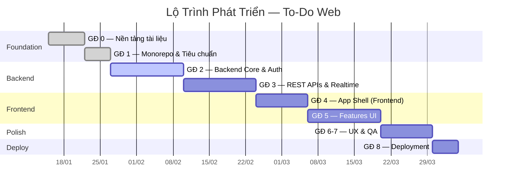
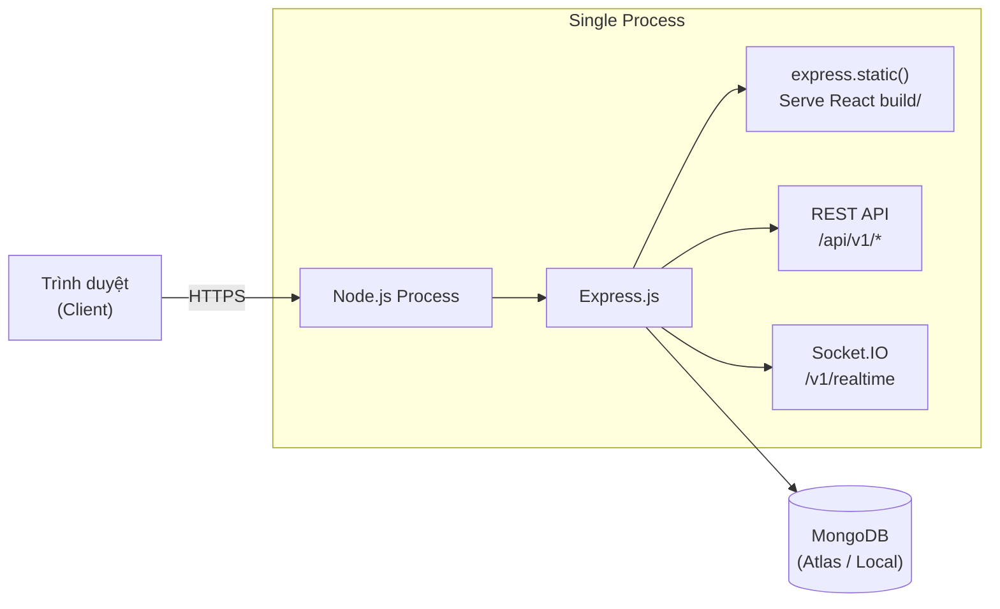

# 06 — Kế Hoạch Triển Khai

> **Phiên bản:** 1.0 · **Cập nhật lần cuối:** 2026-03-25

---

## 1. Lộ Trình Phát Triển (8 Giai Đoạn)



### Chi tiết từng giai đoạn

| Giai đoạn | Mục tiêu | Nhiệm vụ chính | Tiêu chí hoàn thành |
|-----------|---------|-----------------|---------------------|
| **0 — Nền tảng** | Thống nhất specs | Viết docs: CSDL, API, Giao diện, Kế hoạch | Tất cả 4 docs được review ✅ |
| **1 — Monorepo** | Setup cấu trúc folder | ESLint/Prettier config, `.env.example`, folder `frontend/` & `backend/` | `npm run lint` pass hoàn toàn |
| **2 — Backend Core** | Data layer + Auth | Kết nối MongoDB, Mongoose models, JWT Refresh Strategy, Passport (Google/GitHub OAuth) | Register + Login + OAuth functional |
| **3 — REST APIs** | Xương sống dữ liệu | CRUD Tasks (Kanban), Admin APIs, Socket.IO events lifecycle | Tất cả endpoints pass Postman tests |
| **4 — App Shell** | Scaffold React | TailwindCSS + Brand tokens, react-router-dom + Route Guards, HTTP Interceptors, i18n setup | App khởi động, Protected routes work |
| **5 — Features UI** | Ráp data vào UI | Auth pages, Task Board, Profile/Settings, Admin Dashboard, Socket.IO integration | Tất cả User Stories implement |
| **6-7 — UX & QA** | Chất lượng "WOW" | Kiểm tra motion 220ms, focus rings, touch target ≥44px, Skeleton loading, E2E tests | Manual E2E pass, Performance ok |
| **8 — Deploy** | Production | Node serve React static, Health checks, Monitoring alerts | App chạy trên production URL |

---

## 2. Deployment Strategy

### 2.1 Kiến trúc Monolith



**Chiến lược:** Monolith — 1 process Node.js phục vụ cả:
- React SPA (static files từ `/build`)
- REST API (`/api/v1/*`)
- WebSocket (Socket.IO `/v1/realtime`)

### 2.2 Environment Setup

```bash
# .env.example
NODE_ENV=production
PORT=3000

# MongoDB
MONGODB_URI=mongodb+srv://<user>:<pass>@cluster.mongodb.net/todo-web

# JWT
JWT_ACCESS_SECRET=<random-256-bit>
JWT_ACCESS_EXPIRES_IN=15m
JWT_REFRESH_EXPIRES_IN=7d

# OAuth - Google
GOOGLE_CLIENT_ID=<google-client-id>
GOOGLE_CLIENT_SECRET=<google-client-secret>
GOOGLE_CALLBACK_URL=https://<domain>/api/v1/auth/google/callback

# OAuth - GitHub
GITHUB_CLIENT_ID=<github-client-id>
GITHUB_CLIENT_SECRET=<github-client-secret>
GITHUB_CALLBACK_URL=https://<domain>/api/v1/auth/github/callback

# Client
CLIENT_URL=https://<domain>
```

### 2.3 Health Checks

| Endpoint | Method | Expected |
|----------|--------|----------|
| `/health` | GET | `{ status: "ok", uptime: 12345, db: "connected" }` |
| `/health/db` | GET | `{ status: "ok", latencyMs: 5 }` |

### 2.4 Migration Scripts

> **QUAN TRỌNG:** Chạy migration scripts trước khi deploy feature mới.

```bash
# Tạo indexes trên production MongoDB
node scripts/migrate-indexes.js
```

| Script | Mô tả |
|--------|-------|
| `migrate-indexes.js` | Tạo tất cả indexes theo [02-thiet-ke-csdl.md](./02-thiet-ke-csdl.md#3-chiến-lược-chỉ-mục) |
| `seed-admin.js` | Tạo tài khoản admin đầu tiên |
| `purge-expired.js` | Cron job xóa soft-deleted data > 7 ngày |

---

## 3. Monitoring & Alerts

| Metric | Ngưỡng cảnh báo | Action |
|--------|-----------------|--------|
| **Response time** | > 2s (avg) | Check DB queries, add indexes |
| **Error rate** | > 5% requests | Check logs, identify failing endpoints |
| **Memory usage** | > 80% allocated | Check memory leaks, restart process |
| **DB connections** | > 90% pool | Increase pool size hoặc optimize queries |
| **Socket.IO connections** | > 1000 concurrent | Consider scaling strategy |

---

> **Tham chiếu:**
> - Tổng quan tech stack → [00-tong-quan.md](./00-tong-quan.md)
> - Kiến trúc chi tiết → [05-kien-truc-he-thong.md](./05-kien-truc-he-thong.md)
