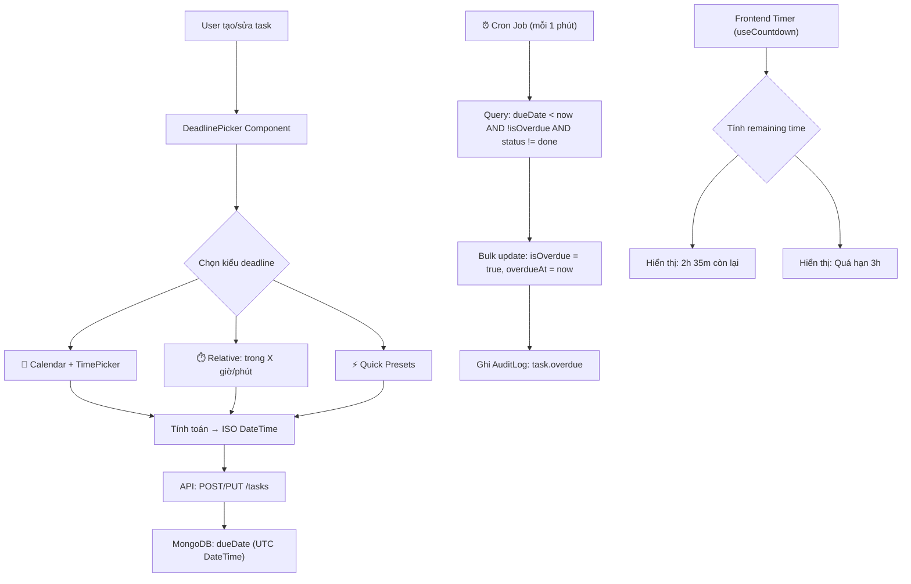

# Smart Deadline & Overdue Detection System

Nâng cấp hệ thống hạn chót (deadline) cho To-Do List app — từ calendar đơn giản sang hệ thống deadline thông minh với cron đánh giá overdue, đếm ngược real-time, và input linh hoạt.

## Phân Tích Hiện Trạng

### Những gì đã có:
- **Task Model**: `dueDate` (Date, nullable), `explicitOverdue` (Boolean) — nhưng chưa được sử dụng thực sự
- **Frontend**: Calendar picker chỉ chọn ngày (không có giờ), hiển thị `dd/MM/yyyy`
- **TaskCard**: Logic overdue chỉ so sánh ngày đơn giản (`dueDate.getTime() < now.getTime()`)
- **Backend**: Không có cron job nào, không có logic tự động đánh dấu overdue

### Vấn đề cần giải quyết:
1. Không thể đặt deadline theo giờ cụ thể (chỉ theo ngày)
2. Không có cơ chế server-side đánh giá overdue tự động
3. Không có countdown real-time trên UI
4. Input hạn chót không linh hoạt (chỉ có calendar)

---

## User Review Required

### Các quyết định đã chốt (từ review):
- ✅ **Cron interval**: Mỗi 1 phút
- ✅ **Overdue = flag riêng**, tuyệt đối KHÔNG thêm vào enum status. Query kết hợp: `status !== 'done' && isOverdue === true`
- ✅ **Presets**: 30m, 1h, 3h, 5h, Chiều nay (17:00), Cuối ngày (23:59), Mai 9:00, Cuối tuần (T7 9:00 — smart label), Đầu tuần sau (T2 9:00)
- ✅ **Timezone**: Browser timezone → Server UTC. Không cần picker timezone thủ công
- ✅ **Notifications**: Defer sang Phase 2. `useCountdown` hook đã cover 80% trải nghiệm
- ✅ **Cron không reset overdue** — logic reset nằm trong `updateTask` API
- ✅ **Audit log cron**: Dùng `insertMany()` batch insert, hoặc skip nếu không cần
- ✅ **useCountdown interval**: `setInterval(10000)` (10s) thay vì 60s để UI mượt hơn

> [!WARNING]
> **Breaking change nhỏ**: Field `explicitOverdue` trong Task model sẽ được **đổi tên** thành `isOverdue` và thêm field `overdueAt` mới. Dữ liệu cũ cần migration script đơn giản.

---

## Proposed Changes

### Tổng quan kiến trúc



---

### Component 1: Backend — Schema & Data Layer

#### [MODIFY] [Task.js](file:///c:/Users/Admin/Desktop/cong-nghe-web-giua-ki/to-do-list/backend/src/models/Task.js)

Cập nhật Task schema để hỗ trợ datetime chính xác và overdue tracking:

```diff
 dueDate: {
   type: Date,
   default: null,
 },
-explicitOverdue: {
-  type: Boolean,
-  default: false,
-},
+isOverdue: {
+  type: Boolean,
+  default: false,
+},
+overdueAt: {
+  type: Date,
+  default: null,
+},
```

**Chi tiết thay đổi:**
- `explicitOverdue` → `isOverdue`: Đổi tên cho rõ ràng hơn, field này sẽ được cron job tự động set
- `overdueAt`: Timestamp khi task bị đánh dấu overdue (dùng cho analytics và hiển thị "Quá hạn từ lúc...")
- `dueDate`: Giữ nguyên type `Date` nhưng bây giờ sẽ **lưu cả giờ phút** (trước đây chỉ lưu ngày 00:00:00)
- Thêm index: `{ isOverdue: 1, dueDate: 1 }` để tối ưu cron query

---

### Component 2: Backend — Cron Overdue Evaluator

#### [NEW] [cronJobs.js](file:///c:/Users/Admin/Desktop/cong-nghe-web-giua-ki/to-do-list/backend/src/cron/cronJobs.js)

Module quản lý tất cả cron jobs của app. Sử dụng `node-cron` library.

**Logic chính:**

```javascript
// Pseudo-code cho overdue evaluator
// Chạy mỗi 1 phút
cron.schedule('* * * * *', async () => {
  const now = new Date();

  // 1. Tìm tất cả task chưa overdue, có dueDate đã qua, chưa done, chưa bị xóa
  const overdueTasks = await Task.find({
    dueDate: { $ne: null, $lt: now },
    isOverdue: { $ne: true },
    status: { $ne: 'done' },
    deletedAt: null,
  });

  // 2. Bulk update
  if (overdueTasks.length > 0) {
    const taskIds = overdueTasks.map(t => t._id);
    await Task.updateMany(
      { _id: { $in: taskIds } },
      { $set: { isOverdue: true, overdueAt: now } }
    );

    // 3. Batch audit log (insertMany thay vì loop)
    const auditDocs = overdueTasks.map(task => ({
      actorId: task.ownerId,
      targetId: task.ownerId,
      action: 'task.overdue',
      entityType: 'task',
      entityId: task._id,
      summaryBefore: { isOverdue: false },
      summaryAfter: { isOverdue: true, overdueAt: now },
    }));
    await AuditLog.insertMany(auditDocs).catch(() => {});
  }

  // NOTE: KHÔNG reset overdue ở đây (Tối ưu theo Quyết định #6).
  // Logic reset isOverdue được thực hiện TRỰC TIẾP trong `updateTask` API
  // khi user cập nhật dueDate > now hoặc status = 'done'.
});
```

**Cron jobs bao gồm:**
1. **Overdue Evaluator** (`* * * * *` — mỗi phút): Đánh giá và đánh dấu task overdue
2. **Expired Task Purge** (đã có logic trong `taskViewModel.purgeExpiredDeletedTasks`, sẽ hook vào cron `0 3 * * *` — 3h sáng mỗi ngày)

---

### Component 3: Backend — ViewModel & API Updates

#### [MODIFY] [taskViewModel.js](file:///c:/Users/Admin/Desktop/cong-nghe-web-giua-ki/to-do-list/backend/src/viewmodels/taskViewModel.js)

**Thay đổi:**

1. **`createTask`**: Thêm validate `dueDate` phải là ISO datetime hợp lệ (nếu có), và phải > now
2. **`updateTask`**: 
   - Khi user cập nhật `dueDate` sang tương lai → auto reset `isOverdue = false`, `overdueAt = null`
   - Khi user đổi status sang `done` → auto reset `isOverdue = false`
3. **`getAllTasks`**: Thêm filter `isOverdue=true/false` trong query params
4. **`buildTaskSummary`**: Thêm `isOverdue` và `overdueAt` vào summary
5. **Allowed fields**: Thêm `isOverdue` vào danh sách fields trả về (nhưng KHÔNG cho phép client set trực tiếp — chỉ cron mới set)

#### [MODIFY] [tasksRouters.js](file:///c:/Users/Admin/Desktop/cong-nghe-web-giua-ki/to-do-list/backend/src/routes/tasksRouters.js)

Không cần route mới. Existing routes đã đủ.

#### [MODIFY] [server.js](file:///c:/Users/Admin/Desktop/cong-nghe-web-giua-ki/to-do-list/backend/src/server.js)

Thêm khởi tạo cron jobs sau khi connect DB thành công:

```diff
 connectDB()
   .then(() => {
+    // Khởi tạo cron jobs
+    initCronJobs();
+
     app.listen(PORT, () => {
       console.log(`server listen port http://localhost:${PORT}`);
     });
   })
```

---

### Component 4: Frontend — DeadlinePicker Component

#### [NEW] [DeadlinePicker.jsx](file:///c:/Users/Admin/Desktop/cong-nghe-web-giua-ki/to-do-list/frontend/src/components/DeadlinePicker.jsx)

Component mới thay thế cho Calendar popover hiện tại. Bao gồm 3 chế độ input:

**Tab 1 — Quick Presets (⚡ Nhanh)**
```
┌─────────────────────────────────────────┐
│  ⚡ NHANH  │  📅 LỊCH  │  ⏱️ TÙY CHỈNH │
├─────────────────────────────────────────┤
│                                         │
│  ┌──────────┐  ┌──────────┐            │
│  │ 30 phút  │  │  1 giờ   │            │
│  └──────────┘  └──────────┘            │
│  ┌──────────┐  ┌──────────┐            │
│  │  3 giờ   │  │  5 giờ   │            │
│  └──────────┘  └──────────┘            │
│  ┌──────────────┐ ┌────────────────┐   │
│  │ Chiều nay    │ │ Cuối ngày      │   │
│  │ (17:00)      │ │ (23:59)        │   │
│  └──────────────┘ └────────────────┘   │
│  ┌──────────────┐ ┌────────────────┐   │
│  │ Mai 9:00     │ │ Cuối tuần      │   │
│  └──────────────┘ │ (smart label)  │   │
│                    └────────────────┘   │
│  ┌──────────────────────────┐          │
│  │      Đầu tuần sau        │          │
│  └──────────────────────────┘          │
│                                         │
│  * Nếu hôm nay T7/CN → "Cuối tuần sau"│
│  Hạn: 10/04/2026 lúc 06:56             │
└─────────────────────────────────────────┘
```

**Tab 2 — Calendar + Time (📅 Lịch)**
```
┌─────────────────────────────────────────┐
│  ⚡ NHANH  │  📅 LỊCH  │  ⏱️ TÙY CHỈNH │
├─────────────────────────────────────────┤
│                                         │
│        [  Calendar Component  ]         │
│                                         │
│  Giờ: [09] : [00]   ○ Sáng  ● Chiều   │
│                                         │
│  Hạn: 15/04/2026 lúc 14:00             │
└─────────────────────────────────────────┘
```

**Tab 3 — Custom Duration (⏱️ Tùy chỉnh)**
```
┌─────────────────────────────────────────┐
│  ⚡ NHANH  │  📅 LỊCH  │  ⏱️ TÙY CHỈNH │
├─────────────────────────────────────────┤
│                                         │
│  Trong  [ 5 ]  [  giờ   ▾]  nữa       │
│                                         │
│  Đơn vị: phút / giờ / ngày             │
│                                         │
│  Hạn: 10/04/2026 lúc 11:26             │
└─────────────────────────────────────────┘
```

**Props:**
```typescript
interface DeadlinePickerProps {
  value: string;          // ISO datetime string
  onChange: (iso: string) => void;
  onClear?: () => void;   // Xoá deadline
}
```

**Tất cả tab đều output ra 1 giá trị duy nhất: ISO datetime string** — đảm bảo consistency cho API.

---

### Component 5: Frontend — Countdown Hook & Display

#### [NEW] [useCountdown.js](file:///c:/Users/Admin/Desktop/cong-nghe-web-giua-ki/to-do-list/frontend/src/hooks/useCountdown.js)

Custom React hook xử lý đếm ngược real-time:

```javascript
// API
const { remaining, isOverdue, label } = useCountdown(dueDateISO);

// Output examples:
// remaining: { days: 0, hours: 2, minutes: 35 }
// isOverdue: false
// label: "2h 35m còn lại"

// remaining: { days: 0, hours: 3, minutes: 12 }
// isOverdue: true
// label: "Quá hạn 3h 12m"
```

**Implementation:**
- Sử dụng `setInterval(10000)` — update mỗi 10 giây (đủ mượt để UI nhảy số đúng lúc phút đổi, chi phí tính toán ≈ 0)
- Cleanup interval khi component unmount
- Trả về object có `label` dạng human-readable tiếng Việt
- Logic format:
  - `< 1 giờ`: "X phút còn lại"
  - `1-24 giờ`: "Xh Ym còn lại"  
  - `1-7 ngày`: "X ngày Y giờ còn lại"
  - `> 7 ngày`: "X ngày còn lại"
  - Overdue: "Quá hạn Xh Ym" (highlight đỏ)

#### [NEW] [CountdownBadge.jsx](file:///c:/Users/Admin/Desktop/cong-nghe-web-giua-ki/to-do-list/frontend/src/components/CountdownBadge.jsx)

Component hiển thị badge đếm ngược trên TaskCard:

```
┌──────────────────────┐
│ ⏱️ 2h 35m còn lại    │  ← Xanh/vàng
└──────────────────────┘

┌──────────────────────┐
│ 🔴 Quá hạn 3h 12m   │  ← Đỏ, pulse animation
└──────────────────────┘

┌──────────────────────┐
│ ⚡ Hôm nay lúc 14:00 │  ← Cam/highlight
└──────────────────────┘
```

---

### Component 6: Frontend — UI Integration

#### [MODIFY] [TaskCard.jsx](file:///c:/Users/Admin/Desktop/cong-nghe-web-giua-ki/to-do-list/frontend/src/components/TaskCard.jsx)

- Thay thế badge `Hạn: dd/MM/yyyy` bằng `CountdownBadge`
- Hiển thị countdown real-time thay vì chỉ ngày tĩnh
- Thêm visual urgency levels (màu sắc thay đổi theo mức độ gấp)

#### [MODIFY] [NewTaskPage.jsx](file:///c:/Users/Admin/Desktop/cong-nghe-web-giua-ki/to-do-list/frontend/src/pages/NewTaskPage.jsx)

- Thay thế Calendar popover hiện tại bằng `DeadlinePicker` component mới
- Toàn bộ block "Hạn chót" (line 211-247) sẽ được thay bằng `<DeadlinePicker />`

#### [MODIFY] [EditTaskPage.jsx](file:///c:/Users/Admin/Desktop/cong-nghe-web-giua-ki/to-do-list/frontend/src/pages/EditTaskPage.jsx)

- Tương tự NewTaskPage — thay Calendar popover bằng `DeadlinePicker`
- Block "Hạn chót" (line 329-367) sẽ được thay bằng `<DeadlinePicker />`

#### [MODIFY] [TaskDetailPage.jsx](file:///c:/Users/Admin/Desktop/cong-nghe-web-giua-ki/to-do-list/frontend/src/pages/TaskDetailPage.jsx)

- Thay thế block "Hạn chót công việc" (line 240-261) bằng countdown display chi tiết hơn:
  - Hiển thị: ngày giờ cụ thể **VÀ** countdown
  - Nếu overdue: hiển thị cảnh báo đỏ với thời gian quá hạn
  - Nếu task `done`: hiển thị "Đã hoàn thành trước hạn X giờ" hoặc "Đã hoàn thành (quá hạn Y giờ)"

#### [MODIFY] [taskSchema.js](file:///c:/Users/Admin/Desktop/cong-nghe-web-giua-ki/to-do-list/frontend/src/lib/taskSchema.js)

```diff
 dueDate: z
   .string()
+  .refine((val) => {
+    if (!val) return true;
+    const date = new Date(val);
+    return !isNaN(date.getTime());
+  }, "Thời hạn không hợp lệ")
   .optional()
   .or(z.literal("")),
```

---

### Component 7: Migration Script

#### [NEW] [migrateOverdueField.js](file:///c:/Users/Admin/Desktop/cong-nghe-web-giua-ki/to-do-list/backend/src/scripts/migrateOverdueField.js)

Script one-time chạy migration:

```javascript
// 1. Rename explicitOverdue → isOverdue
await Task.updateMany(
  { explicitOverdue: { $exists: true } },
  [
    { $set: { isOverdue: '$explicitOverdue' } },
    { $unset: 'explicitOverdue' }
  ]
);

// 2. Evaluate existing tasks that are already overdue
const now = new Date();
await Task.updateMany(
  {
    dueDate: { $ne: null, $lt: now },
    status: { $ne: 'done' },
    deletedAt: null,
    isOverdue: { $ne: true },
  },
  { $set: { isOverdue: true, overdueAt: now } }
);
```

---

## Dependency mới cần cài

### Backend
```bash
npm install node-cron
```

### Frontend
Không cần thêm dependency mới — `date-fns` đã có sẵn đủ dùng.

---

## Thứ tự triển khai đề xuất

| Phase | Công việc | Ước tính |
|-------|-----------|----------|
| 1 | Schema migration + Model update | 15 min |
| 2 | Cron job module + overdue evaluator | 30 min |
| 3 | ViewModel & API updates | 20 min |
| 4 | `useCountdown` hook + `CountdownBadge` | 25 min |
| 5 | `DeadlinePicker` component (3 tabs) | 45 min |
| 6 | Integration vào New/Edit/Detail/Card | 30 min |
| 7 | Testing & polish | 20 min |

---

## ~~Open Questions~~ — Đã chốt

Tất cả câu hỏi đã được user trả lời trong review:
- ❌ Không thêm `overdue` vào status enum — dùng flag `isOverdue` riêng
- ❌ Notification defer sang Phase 2
- ✅ Cuối tuần: nếu T7/CN → label đổi thành "Cuối tuần sau", set T7 tuần sau

---

## Verification Plan

### Automated Tests
```bash
# Backend: Kiểm tra cron job chạy đúng
node src/scripts/migrateOverdueField.js

# Frontend: Build kiểm tra không lỗi
cd frontend && npm run build
```

### Manual Verification
1. **Tạo task với deadline "trong 2 phút"** → Chờ 2 phút → Kiểm tra cron đánh dấu overdue
2. **Tạo task với calendar + time picker** → Kiểm tra dueDate lưu đúng giờ phút
3. **Kiểm tra countdown badge** trên TaskCard cập nhật real-time
4. **Edit task đổi deadline sang tương lai** → Kiểm tra overdue flag được reset
5. **Hoàn thành task overdue** → Kiểm tra hiển thị "Đã hoàn thành (quá hạn X giờ)"
6. **Browser testing**: Mở app trên mobile viewport, kiểm tra DeadlinePicker responsive
