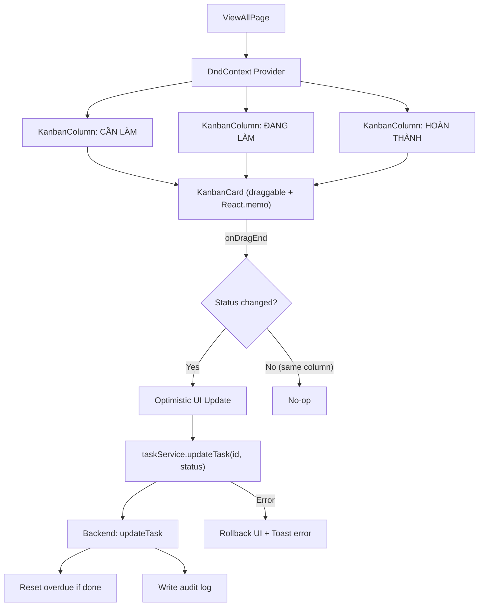
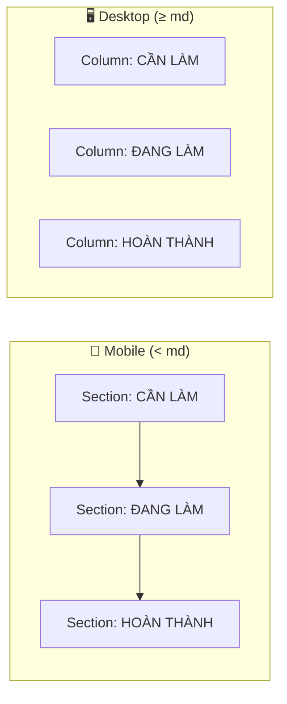

# Drag & Drop Task Status — ViewAllPage

Thêm tính năng kéo thả (drag and drop) trên trang **Xem tất cả** để thay đổi trạng thái task nhanh chóng giữa 3 cột: **Cần làm → Đang làm → Hoàn thành**.

## Các quyết định đã chốt (từ review)

- ✅ **Library**: `@dnd-kit` — approved
- ✅ **Card content**: Title (uppercase, line-clamp-1~2) + Deadline label. **Priority biểu diễn bằng màu viền card (border color)**. **Không hiển thị tags**.
- ✅ **Mobile scroll lock**: Thêm `touch-action: none` trên drag handle để tránh conflict giữa scroll và drag.
- ✅ **Performance**: Dùng `React.memo` cho `KanbanCard` để tránh lag khi cột có > 50 tasks.
- ✅ **Layout responsive**:
  - **Mobile (dọc)**: 3 section xếp chồng, tối ưu diện tích. Max height per section với expand/collapse (`...+N`). Ẩn scrollbar thô.
  - **Tablet/Desktop (ngang)**: 3 cột side-by-side (`flex flex-col md:flex-row gap-4`).
- ✅ **Mobile drag activation**: Long press 200ms + tolerance 5px.
- ✅ **Backend**: Không cần thay đổi — `PUT /tasks/:id` đã đủ.

---

## Proposed Changes

### Tổng quan kiến trúc

### Responsive Layout

---

## Thành phần triển khai (Components)

### 1. KanbanCard.jsx
Compact draggable card, wrapped với `React.memo`.
- **Thiết kế**: Grip handle + Title + Deadline trên cùng một dòng (single-line).
- **Priority**: Biểu diễn bằng `border-left 4px` (Đỏ: High, Vàng: Medium, Xanh: Low).
- **Touch**: Hỗ trợ `touch-action: none` để kéo mượt trên mobile.

### 2. KanbanColumn.jsx
Droppable column hỗ trợ responsive.
- **Mobile**: Section dọc, hiển thị tối đa 4 card, có nút expand/collapse.
- **Desktop**: 3 cột ngang, hỗ trợ cuộn nội bộ (scroll-hide).

### 3. ViewAllPage.jsx
Refactor toàn bộ trang để tích hợp `DndContext`.
- Sử dụng `PointerSensor` và `TouchSensor`.
- Xử lý Optimistic Update và Error Rollback.
- Tích hợp Toast thông báo khi chuyển trạng thái thành công.

---

## Tương thích Cron Job

Backend `PUT /tasks/:id` đảm bảo tính nhất quán dữ liệu với Cron Job:
- Khi chuyển sang **Done**: Tự động set `completedAt`, reset `isOverdue = false`.
- Cron Job chỉ quét các task có `status !== 'done'`, do đó task vừa kéo sang Done sẽ không bị đánh dấu Overdue sai lệch.

---

## Nhật ký Fix lỗi & Tối ưu (Final Polish)

Trong quá trình thực hiện, các cải tiến quan trọng đã được áp dụng:

1. **Fix Bug Navigation**: 
   - *Vấn đề*: Thoát khỏi Task Detail bị nhảy về Homepage thay vì ViewAll.
   - *Giải pháp*: Truyền `state: { returnTo: '/view-all' }` khi điều hướng từ ViewAllPage.
2. **Tối ưu không gian (Compact Design)**:
   - **Header**: Thu gọn Header "Xem tất cả" và Badge tổng số task vào cùng một dòng.
   - **Card**: Rút gọn nhãn thời gian (ví dụ: "TRỄ 10 TIẾNG" -> "TRỄ 10H") để 3 section luôn nằm trong một màn hình mobile.

---

## Verification Plan

### Manual Verification
1. **Drag & Drop**: Kiểm tra kéo task giữa các cột, đảm bảo status cập nhật trong DB.
2. **Cron compat**: Đảm bảo task overdue khi kéo sang Done không còn bị quét bởi cron.
3. **Responsive**: 3 cột ngang trên Desktop, 3 section dọc trên Mobile.
4. **Navigation**: Back từ Task Detail quay lại đúng trang Xem tất cả.
5. **Mobile Touch**: Nhấn giữ 200ms để bắt đầu kéo ổn định.
