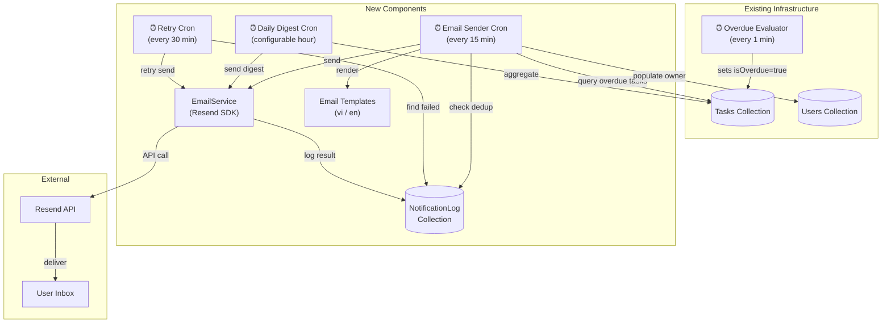

# Overdue Task Email Notification — Architecture

## 1. Architecture Overview



---

## 2. Component Architecture

### 2a. EmailService — `src/services/emailService.js`

**Responsibility:** Encapsulate all Resend API interactions. Render email templates. Handle send failures gracefully.

```javascript
import { Resend } from 'resend';
import { config } from '../config/env.js';

class EmailService {
  constructor() {
    this.resend = new Resend(config.resend.apiKey);
    this.fromAddress = 'TaskDo <notifications@resend.dev>';
    // Use verified domain in production: 'TaskDo <notifications@yourdomain.com>'
  }

  /**
   * Send an individual overdue task notification.
   * @param {Object} user - { _id, email, displayName, preferredLanguage }
   * @param {Object} task - { _id, title, priority, dueDate, description }
   * @returns {{ messageId: string }}
   */
  async sendOverdueNotification(user, task) { /* ... */ }

  /**
   * Send a daily digest of all overdue tasks.
   * @param {Object} user - { _id, email, displayName, preferredLanguage }
   * @param {Array} tasks - [{ _id, title, priority, dueDate }]
   * @returns {{ messageId: string }}
   */
  async sendOverdueDigest(user, tasks) { /* ... */ }

  /**
   * Generate HMAC unsubscribe token for a user.
   * @param {string} userId
   * @returns {string} HMAC-SHA256 hex token
   */
  generateUnsubscribeToken(userId) { /* ... */ }

  /**
   * Verify an unsubscribe token.
   * @param {string} userId
   * @param {string} token
   * @returns {boolean}
   */
  verifyUnsubscribeToken(userId, token) { /* ... */ }
}

export default new EmailService();
```

**Resend Send Configuration:**
```javascript
async sendOverdueNotification(user, task) {
  const lang = user.preferredLanguage || 'vi';
  const unsubscribeToken = this.generateUnsubscribeToken(user._id.toString());
  const unsubscribeUrl = `${config.app.url}/unsubscribe?userId=${user._id}&token=${unsubscribeToken}`;
  const taskUrl = `${config.app.url}/tasks/${task._id}`;

  const { data, error } = await this.resend.emails.send({
    from: this.fromAddress,
    to: [user.email],
    subject: lang === 'vi'
      ? `[TaskDo] Công việc quá hạn: ${task.title.slice(0, 50)}`
      : `[TaskDo] Overdue task: ${task.title.slice(0, 50)}`,
    html: renderOverdueEmail({ user, task, taskUrl, unsubscribeUrl, lang }),
    headers: {
      'List-Unsubscribe': `<${unsubscribeUrl}>`,
      'List-Unsubscribe-Post': 'List-Unsubscribe=One-Click',
    },
  });

  if (error) throw error;
  return { messageId: data.id };
}
```

---

### 2b. NotificationLog Model — `src/models/NotificationLog.js`

**Responsibility:** Track every email send attempt for deduplication, retry, and audit.

```javascript
const notificationLogSchema = new mongoose.Schema({
  userId:          { type: mongoose.Schema.Types.ObjectId, ref: 'User', required: true },
  taskId:          { type: mongoose.Schema.Types.ObjectId, ref: 'Task', default: null }, // null for digest
  type:            { type: String, enum: ['overdue_single', 'overdue_digest'], required: true },
  status:          { type: String, enum: ['sent', 'failed', 'bounced', 'abandoned'], default: 'sent' },
  resendMessageId: { type: String, default: null },
  error:           { type: String, default: null },
  retryCount:      { type: Number, default: 0 },
  nextRetryAt:     { type: Date, default: null },
  taskSnapshot: {
    title:    { type: String },
    priority: { type: String },
    dueDate:  { type: Date },
  },
}, {
  timestamps: true,
  collection: 'notification_logs',
});
```

**Indexes (see database.md for details):** TTL 90 days, dedup compound, retry query, user history.

---

### 2c. User Model Extension — Notification Preferences

Add a `notificationPreferences` subdocument to the existing User schema:

```javascript
notificationPreferences: {
  emailOverdue:   { type: Boolean, default: true },
  emailDigest:    { type: Boolean, default: true },
  digestHour:     { type: Number, default: 8, min: 0, max: 23 },
  timezone:       { type: String, default: 'Asia/Ho_Chi_Minh' },
  unsubscribedAt: { type: Date, default: null },
}
```

---

### 2d. Cron Extension — `src/cron/cronJobs.js`

Three new scheduled jobs added to the existing `cronJobs.js`:

**Job 1: Overdue Email Sender (every 15 minutes)**
```
Schedule: */15 * * * *
Purpose:  Send individual overdue notifications for newly flagged tasks
Flow:
  1. Query tasks: { isOverdue: true, status: { $ne: 'done' }, deletedAt: null }
  2. Populate ownerId with email, displayName, preferredLanguage, status, notificationPreferences
  3. Filter: user.status === 'active' && user.notificationPreferences.emailOverdue === true
  4. For each (user, task) pair:
     a. Check NotificationLog: exists for (userId, taskId, 'overdue_single') in last 24h?
     b. If no → send email → create NotificationLog with status='sent'
     c. If send fails → create NotificationLog with status='failed', retryCount=0, nextRetryAt
  5. Batch processing: process 50 tasks per cycle, 100ms delay between sends
```

**Job 2: Daily Digest (hourly check)**
```
Schedule: 0 * * * *  (every hour, on the hour)
Purpose:  Send daily digest at each user's preferred digestHour
Flow:
  1. Current UTC hour → filter users whose digestHour matches (accounting for timezone)
  2. Query tasks: { isOverdue: true, status: { $ne: 'done' }, deletedAt: null, ownerId: { $in: userIds } }
  3. Group by user
  4. Check NotificationLog: exists for (userId, null, 'overdue_digest') today?
  5. If no → send digest email → create NotificationLog
```

**Job 3: Retry Failed (every 30 minutes)**
```
Schedule: */30 * * * *
Purpose:  Retry failed email sends
Flow:
  1. Query NotificationLog: { status: 'failed', retryCount: { $lt: 3 }, nextRetryAt: { $lte: now } }
  2. For each: re-send via EmailService
  3. On success: update status='sent', set resendMessageId
  4. On failure: increment retryCount, set nextRetryAt = now + (2^retryCount * 5 minutes)
  5. If retryCount >= 3: set status='abandoned'
```

---

## 3. Data Flow

### Individual Overdue Notification Flow

```
1. Existing cron (every 1 min):
   - Task.dueDate < now AND status ≠ 'done' → isOverdue=true, overdueAt=now
   - AuditLog created: 'task.overdue'

2. New cron (every 15 min):
   - Finds tasks where isOverdue=true
   - For each task, checks NotificationLog for existing (userId, taskId) entry
   - If no entry → sends email via Resend
   - Creates NotificationLog entry with taskSnapshot

3. Resend API:
   - Delivers email to user inbox
   - Returns messageId (stored in NotificationLog)

4. User receives email:
   - Opens email → sees task details
   - Clicks "Xem công việc" → deep link to task in app
   - OR clicks "Hủy đăng ký" → unsubscribe endpoint
```

### Daily Digest Flow

```
1. Digest cron (every hour):
   - Checks if current hour matches any user's digestHour (adjusted for timezone)
   - For matching users: aggregate all overdue tasks
   - Check: digest already sent today?
   - If no → send digest email with task summary table
   - Create NotificationLog entry (taskId=null, type='overdue_digest')
```

---

## 4. Deduplication Strategy

**Problem:** Without deduplication, the same user would receive an overdue email every 15 minutes for the same task.

**Solution:** `NotificationLog` acts as a "sent" registry.

```javascript
// Before sending, check:
const alreadySent = await NotificationLog.findOne({
  userId: user._id,
  taskId: task._id,
  type: 'overdue_single',
  status: { $in: ['sent', 'abandoned'] },
  createdAt: { $gte: new Date(Date.now() - 24 * 60 * 60 * 1000) }, // last 24h
});

if (alreadySent) {
  // Skip — already notified for this task
  continue;
}
```

**Atomic check-and-create:** Use `findOneAndUpdate` with `upsert: true` to atomically check and create:
```javascript
const result = await NotificationLog.findOneAndUpdate(
  {
    userId: user._id,
    taskId: task._id,
    type: 'overdue_single',
    createdAt: { $gte: twentyFourHoursAgo },
  },
  {
    $setOnInsert: {
      userId: user._id,
      taskId: task._id,
      type: 'overdue_single',
      status: 'pending',
      taskSnapshot: { title: task.title, priority: task.priority, dueDate: task.dueDate },
    },
  },
  { upsert: true, new: true }
);

// If result was newly inserted (no existing doc), proceed to send
if (result.status === 'pending') {
  // Send email, then update status to 'sent' or 'failed'
}
```

---

## 5. Retry Strategy

| Attempt | Delay | Total Wait |
|---|---|---|
| Initial send | Immediate | 0 |
| Retry 1 | 5 minutes | 5 min |
| Retry 2 | 20 minutes | 25 min |
| Retry 3 | 80 minutes | 105 min |
| Abandoned | — | After ~1h 45m total |

```javascript
function calculateNextRetry(retryCount) {
  const baseDelay = 5 * 60 * 1000; // 5 minutes
  const delay = baseDelay * Math.pow(4, retryCount); // 5m, 20m, 80m
  const jitter = Math.random() * 60 * 1000; // ±1 minute jitter
  return new Date(Date.now() + delay + jitter);
}
```

---

## 6. Email Templates

### Template Structure

```
src/
  services/
    emailService.js
    emailTemplates/
      overdueNotification.js   ← Single task overdue
      overdueDigest.js          ← Daily digest
      components/
        header.js               ← Pop Art logo banner
        footer.js               ← Unsubscribe link + branding
        taskCard.js             ← Single task detail card
        taskTable.js            ← Multi-task summary table
```

### Design Principles

1. **Inline CSS only** — no external stylesheets (Gmail strips `<style>` tags)
2. **Table-based layout** — Outlook compatibility
3. **Fallback fonts** — `'Plus Jakarta Sans', Arial, Helvetica, sans-serif`
4. **Pop Art branding** — thick borders, bold colors matching the app
5. **Dark mode** — `@media (prefers-color-scheme: dark)` for supported clients
6. **Bilingual** — content strings selected by `user.preferredLanguage`

### Single Overdue Email Content

```
Subject (vi): [TaskDo] Công việc quá hạn: {title}
Subject (en): [TaskDo] Overdue task: {title}

Preheader (vi): {title} đã quá hạn {daysSince} ngày. Nhấp để xem chi tiết.
Preheader (en): {title} is {daysSince} days overdue. Click to view details.

Body:
┌─────────────────────────────────────┐
│  [TaskDo Logo]                       │  ← Pop Art banner
├─────────────────────────────────────┤
│                                      │
│  Chào {displayName},                │
│                                      │
│  Công việc sau đã quá hạn:          │
│                                      │
│  ┌───────────────────────────────┐  │
│  │ 📋 {title}                    │  │
│  │ Ưu tiên: {priority badge}    │  │
│  │ Hạn chót: {dueDate}          │  │
│  │ Quá hạn: {daysSince} ngày    │  │
│  └───────────────────────────────┘  │
│                                      │
│  [ Xem công việc → ]                │  ← CTA button → /tasks/{taskId}
│                                      │
├─────────────────────────────────────┤
│  Hủy đăng ký thông báo              │  ← Unsubscribe link
│  © 2026 TaskDo                       │
└─────────────────────────────────────┘
```

---

## 7. Integration Points

| System | Integration | Direction |
|---|---|---|
| **Existing overdue evaluator cron** | Flags tasks → triggers email flow | Upstream → New |
| **Task completion** | When task status → 'done', no new notifications sent (checked by cron query: `status !== 'done'`) | Existing |
| **Task deletion (soft)** | `deletedAt !== null` → excluded from notification query | Existing |
| **User preferences API** | New endpoints for notification settings | New |
| **profileViewModel** | Extended with notification preference methods | Existing + New |
| **Profile routes** | New routes for preferences, unsubscribe, history | Existing + New |
| **AuditLog** | Tracks preference changes | Existing |
| **Frontend Settings page** | New "Thông báo" section | New |

---

## 8. Separation of Concerns

```
┌──────────────────────────────────────────────────────────┐
│  Cron Layer                (cron/cronJobs.js)             │
│  → Scheduling, orchestration, batch processing           │
│  → Queries DB, filters users, calls EmailService         │
├──────────────────────────────────────────────────────────┤
│  Service Layer             (services/emailService.js)    │
│  → Resend API integration, template rendering            │
│  → Send single email, generate/verify unsubscribe token  │
├──────────────────────────────────────────────────────────┤
│  Template Layer            (services/emailTemplates/)    │
│  → HTML email rendering, bilingual content strings       │
│  → Pure functions: (data) → HTML string                  │
├──────────────────────────────────────────────────────────┤
│  Model Layer               (models/NotificationLog.js)   │
│  → Deduplication, retry tracking, history                │
├──────────────────────────────────────────────────────────┤
│  ViewModel Layer           (viewmodels/profileViewModel) │
│  → Notification preference CRUD, unsubscribe handling    │
├──────────────────────────────────────────────────────────┤
│  Route Layer               (routes/profileRoutes.js)     │
│  → HTTP endpoints for preferences, history, unsubscribe  │
└──────────────────────────────────────────────────────────┘
```

---

## 9. Observability

| Signal | Implementation |
|---|---|
| **Email send success** | `console.log('[EMAIL] Sent overdue notification', { userId, taskId, messageId })` |
| **Email send failure** | `console.error('[EMAIL] Failed to send', { userId, taskId, error })` |
| **Retry attempt** | `console.log('[EMAIL] Retrying', { notificationLogId, retryCount })` |
| **Retry abandoned** | `console.warn('[EMAIL] Abandoned after max retries', { notificationLogId })` |
| **Cron cycle stats** | `console.log('[CRON] Email sender cycle', { tasksProcessed, emailsSent, skippedDupes, failures })` |
| **Dedup hit** | Not logged individually (too noisy), but counted in cycle stats |
| **Resend API rate limit** | `console.warn('[EMAIL] Resend rate limit hit', { retryAfter })` |

Future: structured JSON logging with a logging library (e.g., pino) for production observability.
