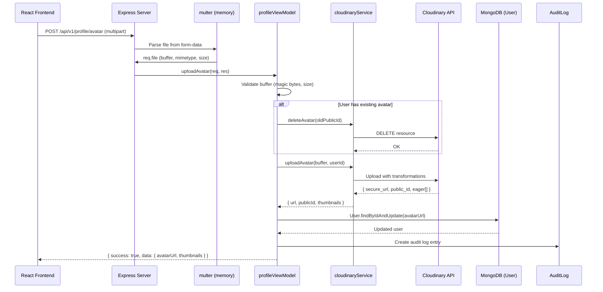

# Upload Profile Image — Architecture

## 1. Architecture Overview



---

## 2. Component Architecture

### 2a. Cloudinary Service — `src/services/cloudinaryService.js`

**Responsibility:** Encapsulate all Cloudinary API interactions. No other module should import the `cloudinary` SDK directly.

```javascript
// Pseudo-signature
import { v2 as cloudinary } from 'cloudinary';
import { config } from '../config/env.js';

class CloudinaryService {
  constructor() {
    cloudinary.config({
      cloud_name: config.cloudinary.cloudName,
      api_key: config.cloudinary.apiKey,
      api_secret: config.cloudinary.apiSecret,
      secure: true,
    });
  }

  /**
   * Upload avatar image buffer to Cloudinary.
   * @param {Buffer} buffer - Raw image bytes from multer
   * @param {string} userId - MongoDB user _id (used in folder path)
   * @returns {{ url: string, publicId: string, thumbnails: { small: string, medium: string } }}
   */
  async uploadAvatar(buffer, userId) { /* ... */ }

  /**
   * Delete avatar from Cloudinary by public_id.
   * @param {string} publicId
   * @returns {boolean} true if destroyed
   */
  async deleteAvatar(publicId) { /* ... */ }

  /**
   * Extract Cloudinary public_id from a secure_url.
   * @param {string} url - e.g. https://res.cloudinary.com/ddnauyhho/image/upload/v123/todoapp/avatars/abc123/avatar.jpg
   * @returns {string} e.g. todoapp/avatars/abc123/avatar
   */
  extractPublicId(url) { /* ... */ }
}

export default new CloudinaryService();
```

**Cloudinary Upload Configuration:**

```javascript
const uploadOptions = {
  folder: `todoapp/avatars/${userId}`,
  public_id: 'avatar',               // Overwrite same public_id on replace
  overwrite: true,
  invalidate: true,                   // Invalidate CDN cache
  resource_type: 'image',
  transformation: [
    { width: 400, height: 400, crop: 'fill', gravity: 'face' },
    { quality: 'auto', fetch_format: 'auto' },
  ],
  eager: [
    { width: 80, height: 80, crop: 'fill', gravity: 'face', quality: 'auto', fetch_format: 'auto' },
    { width: 200, height: 200, crop: 'fill', gravity: 'face', quality: 'auto', fetch_format: 'auto' },
  ],
  eager_async: false,  // Wait for thumbnails
};
```

**Upload Method (buffer → stream):**

```javascript
async uploadAvatar(buffer, userId) {
  return new Promise((resolve, reject) => {
    const uploadStream = cloudinary.uploader.upload_stream(
      { ...uploadOptions, folder: `todoapp/avatars/${userId}` },
      (error, result) => {
        if (error) return reject(error);
        resolve({
          url: result.secure_url,
          publicId: result.public_id,
          thumbnails: {
            small: result.eager?.[0]?.secure_url || result.secure_url,
            medium: result.eager?.[1]?.secure_url || result.secure_url,
          },
        });
      }
    );
    // Pipe buffer into the upload stream
    const { Readable } = require('stream');
    Readable.from(buffer).pipe(uploadStream);
  });
}
```

---

### 2b. Upload Middleware — `src/middleware/imageUpload.js`

**Responsibility:** Parse multipart form data, enforce file constraints.

```javascript
import multer from 'multer';

const ALLOWED_MIME_TYPES = ['image/jpeg', 'image/png', 'image/webp', 'image/gif'];
const MAX_FILE_SIZE = 5 * 1024 * 1024; // 5 MB

const storage = multer.memoryStorage();

const fileFilter = (req, file, cb) => {
  if (!ALLOWED_MIME_TYPES.includes(file.mimetype)) {
    const error = new Error('Invalid file type. Allowed: JPEG, PNG, WebP, GIF');
    error.code = 'AVATAR_INVALID_TYPE';
    error.statusCode = 400;
    return cb(error, false);
  }
  cb(null, true);
};

export const avatarUpload = multer({
  storage,
  fileFilter,
  limits: { fileSize: MAX_FILE_SIZE, files: 1 },
}).single('avatar');

// Magic bytes validation (post-multer)
const MAGIC_BYTES = {
  'image/jpeg': [0xFF, 0xD8, 0xFF],
  'image/png':  [0x89, 0x50, 0x4E, 0x47],
  'image/gif':  [0x47, 0x49, 0x46],
  'image/webp': null, // RIFF header check: bytes 0-3 = 'RIFF', 8-11 = 'WEBP'
};

export function validateImageBuffer(buffer, mimetype) {
  if (!buffer || buffer.length === 0) return false;
  if (mimetype === 'image/webp') {
    return buffer.slice(0, 4).toString() === 'RIFF' && buffer.slice(8, 12).toString() === 'WEBP';
  }
  const expected = MAGIC_BYTES[mimetype];
  if (!expected) return false;
  return expected.every((byte, i) => buffer[i] === byte);
}
```

**Rationale for memory storage:** The file is immediately streamed to Cloudinary — no disk I/O on the server. Max 5 MB per upload is acceptable for memory. The existing STT audio upload uses the same pattern.

---

### 2c. profileViewModel Extension

Add two new methods to the existing `src/viewmodels/profileViewModel.js`:

```javascript
/**
 * Upload or replace user avatar.
 * Called by: POST /api/v1/profile/avatar
 */
async uploadAvatar(req, res) {
  // 1. Validate req.file exists and passes magic-byte check
  // 2. If user.avatarUrl exists → extract publicId → cloudinaryService.deleteAvatar()
  // 3. cloudinaryService.uploadAvatar(req.file.buffer, req.userId)
  // 4. User.findByIdAndUpdate(req.userId, { avatarUrl: result.url })
  // 5. AuditLog.create({ actorId, action: 'user.avatar.upload', entityType: 'user', entityId, summaryBefore, summaryAfter })
  // 6. Return { success: true, data: { avatarUrl, thumbnails } }
}

/**
 * Remove user avatar.
 * Called by: DELETE /api/v1/profile/avatar
 */
async deleteAvatar(req, res) {
  // 1. Check user.avatarUrl exists → if not, throw AVATAR_NOT_FOUND
  // 2. Extract publicId → cloudinaryService.deleteAvatar()
  // 3. User.findByIdAndUpdate(req.userId, { avatarUrl: null })
  // 4. AuditLog.create({ actorId, action: 'user.avatar.delete', ... })
  // 5. Return { success: true, message: 'Avatar removed successfully' }
}
```

**Error handling** follows the existing `ProfileViewModelError` pattern:

```javascript
throw new ProfileViewModelError(400, 'AVATAR_FILE_REQUIRED', 'No image file provided');
throw new ProfileViewModelError(400, 'AVATAR_INVALID_TYPE', 'Invalid image format');
throw new ProfileViewModelError(400, 'AVATAR_NOT_FOUND', 'No avatar to delete');
throw new ProfileViewModelError(500, 'AVATAR_UPLOAD_FAILED', 'Failed to upload avatar');
throw new ProfileViewModelError(500, 'AVATAR_DELETE_FAILED', 'Failed to delete avatar');
```

---

### 2d. Profile Routes Extension

In the existing profile router (e.g., `src/routes/profileRoutes.js`):

```javascript
import { avatarUpload } from '../middleware/imageUpload.js';

// Avatar management
router.post('/avatar', authMiddleware, requireRole('user'), avatarUpload, errorHandler(profileViewModel.uploadAvatar));
router.delete('/avatar', authMiddleware, requireRole('user'), errorHandler(profileViewModel.deleteAvatar));
```

---

### 2e. Frontend — AvatarUpload Component

```
src/components/settings/AvatarUpload.jsx
```

| Element | Detail |
|---|---|
| Avatar display | Uses shadcn `Avatar` + `AvatarImage` + `AvatarFallback` |
| Upload trigger | Hidden `<input type="file" accept="image/*" capture="user">` triggered by camera icon overlay |
| Preview | Immediately show selected file via `URL.createObjectURL()` (optimistic) |
| Progress | Overlay spinner on avatar circle during upload |
| Delete | Trash icon button, gated behind confirmation `Dialog` |
| Error display | `sonner` toast for all error states |

---

## 3. Data Flow Summary

### Upload Flow
```
1. User clicks avatar → file picker opens
2. User selects image
3. Client validates: type ∈ {jpeg,png,webp,gif}, size ≤ 5MB
4. Client shows optimistic preview (createObjectURL)
5. Client sends POST /api/v1/profile/avatar (FormData with 'avatar' field)
6. multer parses → buffer in memory
7. profileViewModel.uploadAvatar:
   a. Validate magic bytes
   b. If old avatar → delete from Cloudinary (best-effort, log on failure)
   c. Upload buffer → Cloudinary (folder: todoapp/avatars/{userId})
   d. Cloudinary returns: secure_url + eager thumbnails
   e. Update User.avatarUrl = secure_url
   f. Create AuditLog
   g. Return { avatarUrl, thumbnails }
8. Client receives URL → updates localStorage user → re-renders all avatar surfaces
```

### Delete Flow
```
1. User clicks delete icon → confirmation dialog
2. User confirms
3. Client sends DELETE /api/v1/profile/avatar
4. profileViewModel.deleteAvatar:
   a. Extract publicId from User.avatarUrl
   b. Delete from Cloudinary
   c. Set User.avatarUrl = null
   d. Create AuditLog
   e. Return success
5. Client clears avatarUrl in localStorage → shows initials fallback
```

### Replace Flow
```
Same as Upload Flow — step 7b handles deleting the old asset before uploading the new one.
```

---

## 4. Cloudinary Configuration Details

| Setting | Value | Rationale |
|---|---|---|
| **Folder** | `todoapp/avatars/{userId}` | User-scoped; easy cleanup on account deletion |
| **public_id** | `avatar` | Fixed name = automatic overwrite on replace (with `invalidate: true`) |
| **Primary transformation** | `w_400,h_400,c_fill,g_face,f_auto,q_auto` | Face-aware crop to 400px square, auto-format for browser, auto-quality |
| **Eager: small** | `w_80,h_80,c_fill,g_face,q_auto,f_auto` | Navigation avatars (AppBar, BottomNav, SidebarNav) |
| **Eager: medium** | `w_200,h_200,c_fill,g_face,q_auto,f_auto` | Card-level avatars (task comments, team views) |
| **CDN delivery** | `https://res.cloudinary.com/{cloud_name}/image/upload/...` | Global CDN with automatic geo-routing |
| **invalidate** | `true` | Forces CDN edge cache refresh on avatar replace |

---

## 5. Integration Points

| System | Integration |
|---|---|
| **authMiddleware** | Protects avatar routes (existing) |
| **requireRole('user')** | Restricts to user role (existing) |
| **AuditLog** | Records avatar changes with before/after snapshots (existing model) |
| **profileViewModel.getProfile** | Already returns `avatarUrl` in profile response — no change needed |
| **Admin user deletion** (`adminViewModel.deleteUserOffline`) | Must call `cloudinaryService.deleteAvatar()` to clean up assets |
| **Frontend localStorage** | `auth_user` object includes `avatarUrl` — update on upload/delete |

---

## 6. Separation of Concerns

```
┌─────────────────────────────────────────────────────────┐
│  Route Layer           (routes/profileRoutes.js)        │
│  → HTTP concern only: method, path, middleware chain    │
├─────────────────────────────────────────────────────────┤
│  Middleware Layer       (middleware/imageUpload.js)      │
│  → File parsing, size/type enforcement                  │
├─────────────────────────────────────────────────────────┤
│  ViewModel Layer        (viewmodels/profileViewModel.js)│
│  → Business logic: validate, orchestrate, audit         │
├─────────────────────────────────────────────────────────┤
│  Service Layer          (services/cloudinaryService.js) │
│  → External API: Cloudinary upload/delete               │
├─────────────────────────────────────────────────────────┤
│  Model Layer            (models/User.js)                │
│  → Data persistence: avatarUrl field                    │
└─────────────────────────────────────────────────────────┘
```

---

## 7. Error Handling Strategy

| Error Source | Handling | User Impact |
|---|---|---|
| multer: file too large | multer throws `LIMIT_FILE_SIZE` → caught in errorHandler → 400 `AVATAR_FILE_TOO_LARGE` | Toast: "Ảnh không được vượt quá 5MB" |
| multer: invalid MIME | fileFilter callback error → 400 `AVATAR_INVALID_TYPE` | Toast: "Chỉ hỗ trợ định dạng JPG, PNG, WebP, GIF" |
| Magic bytes mismatch | profileViewModel validation → 400 `AVATAR_INVALID_TYPE` | Toast: "File không phải là ảnh hợp lệ" |
| Cloudinary upload fails | cloudinaryService throws → 500 `AVATAR_UPLOAD_FAILED` | Toast: "Không thể tải ảnh lên. Vui lòng thử lại" |
| Cloudinary delete fails (old avatar) | Log warning, continue with upload (non-blocking) | No user impact; orphaned asset logged for cleanup |
| DB update fails | Attempt Cloudinary rollback (delete newly uploaded) → 500 | Toast: generic error |

---

## 8. Caching Strategy

| Layer | Cache | TTL | Invalidation |
|---|---|---|---|
| **Cloudinary CDN** | Edge-cached globally | Default (30 days) | `invalidate: true` on upload forces purge |
| **Browser** | `Cache-Control` from Cloudinary response | Automatic | New URL on replace (version changes) |
| **localStorage** | `auth_user.avatarUrl` | Until next login/refresh | Updated immediately on upload/delete |
| **React component state** | In-memory | Component lifecycle | Re-reads from localStorage via callback |
