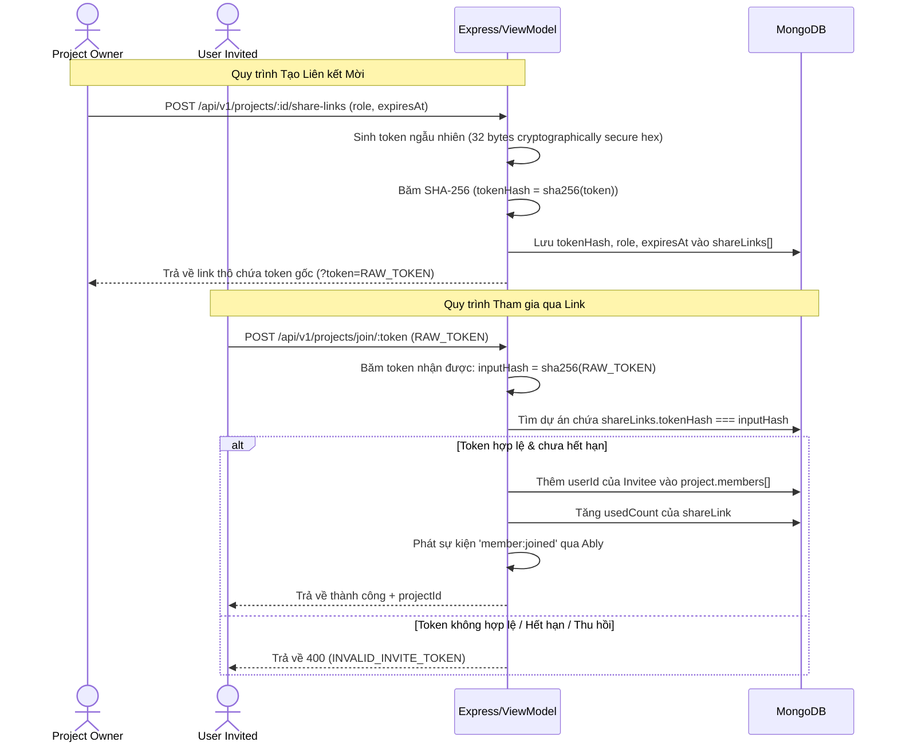

# Kiến trúc Hệ thống: Collaborative Project Workspace System

Tài liệu này mô tả chi tiết thiết kế kiến trúc kỹ thuật của hệ thống không gian làm việc nhóm, cách thức tích hợp vào mô hình MVVM (Model-View-ViewModel) hiện tại, quy trình xử lý dữ liệu thời gian thực qua **Ably**, và cơ chế kiểm soát phân quyền.

---

## 1. Mô hình Kiến trúc MVVM (Model-View-ViewModel)

Hệ thống tuân thủ chặt chẽ kiến trúc MVVM của dự án:
*   **Model (Mongoose Schema):** Định nghĩa cấu trúc lưu trữ dữ liệu dự án (`Project.js`), công việc (`Task.js`), và nhật ký hoạt động (`AuditLog.js`).
*   **ViewModel (Business Logic Layer):** `projectViewModel.js` đóng vai trò là lớp nghiệp vụ tập trung duy nhất, đóng gói toàn bộ logic quản lý thành viên, xử lý mã mời, cấp phép vai trò, và phát tín hiệu real-time qua Ably. Lớp route hoàn toàn không chứa nghiệp vụ.
*   **View (React Components & Pages):** Sử dụng các component React để hiển thị dữ liệu trạng thái dự án, đăng ký sự kiện lắng nghe kênh truyền thông Ably, và cập nhật giao diện người dùng mượt mà theo phong cách Pop Art.

### Sơ đồ Luồng Dữ liệu (Backend Flow)
```
Request ──> Express Route ──> authenticateToken ──> projectViewModel ──> Mongoose Model ──> DB
                                                            │
                                                            └──> Ably Channel Broadcast
```

---

## 2. Thiết kế Luồng Real-time bằng Ably

Hệ thống thay thế hoàn toàn hạ tầng Socket.IO cũ bằng **Ably** nhằm đảm bảo khả năng mở rộng (scale), độ trễ thấp và độ tin cậy cấp doanh nghiệp.

### Chiến lược Kênh (Channel Strategy)
Mỗi dự án hoạt động trong một không gian kênh riêng biệt trên Ably:
*   **Tên Kênh (Channel Name):** `project:[projectId]` (Ví dụ: `project:60c72b2f9b1d8e001c888888`).
*   **Luồng Sự kiện (Events):**
    *   `task:created`: Phát khi một nhiệm vụ mới được thêm vào dự án.
    *   `task:updated`: Phát khi nhiệm vụ thay đổi tiêu đề, mô tả, cột trạng thái, độ ưu tiên, v.v.
    *   `task:deleted`: Phát khi nhiệm vụ bị xóa hoặc đưa vào thùng rác.
    *   `member:joined` / `member:left` / `member:updated`: Đồng bộ hóa trạng thái thay đổi nhân sự trong dự án.

### Trạng thái Hiện diện Trực tuyến (Presence Protocol)
Ably Presence API được sử dụng để theo dõi trực tiếp các thành viên đang hoạt động trong dự án:
1.  Khi người dùng truy cập màn hình `ProjectDetailPage`, client thực hiện kết nối và đăng ký hiện diện (`presence.enter`) trên kênh dự án, gửi kèm thông tin định danh: `{ userId, name, email, avatarUrl }`.
2.  Client lắng nghe các sự kiện hiện diện (`presence.subscribe`) như `enter`, `leave`, `update` để cập nhật trực tiếp danh sách Avatar ở góc Header của giao diện.
3.  Khi người dùng đóng trang hoặc ngắt kết nối, Ably tự động gửi tín hiệu `leave` để cập nhật trạng thái cho những thành viên khác.

---

## 3. Quy trình Đăng ký & Cơ chế Bảo mật Mã mời

Để tránh lỗ hổng bảo mật rò rỉ Plaintext Token trong database, hệ thống áp dụng cơ chế xác thực token một chiều (Tương tự mã hóa mật khẩu):

### Quy trình Tạo & Sử dụng Secure Invite Link


---

## 4. Hệ thống Phân quyền Phân cấp (Cascading Role & Permission)

Mọi quyền hạn được phân cấp kế thừa từ cao xuống thấp:

| Quyền hạn | Viewer | Commenter | Editor | Owner |
|---|:---:|:---:|:---:|:---:|
| Xem thông tin dự án & nhiệm vụ | ✅ | ✅ | ✅ | ✅ |
| Tạo bình luận | ❌ | ✅ | ✅ | ✅ |
| Thêm/Sửa/Kéo thả Task | ❌ | ❌ | ✅ | ✅ |
| Xóa Task | ❌ | ❌ | ✅ | ✅ |
| Mời thành viên mới | ❌ | ❌ | ✅ | ✅ |
| Quản lý vai trò thành viên | ❌ | ❌ | ❌ | ✅ |
| Xóa thành viên | ❌ | ❌ | ❌ | ✅ |
| Tạo/Thu hồi Share Link & Mã mời | ❌ | ❌ | ❌ | ✅ |
| Lưu trữ / Khôi phục dự án | ❌ | ❌ | ❌ | ✅ |
| Chuyển giao quyền sở hữu dự án | ❌ | ❌ | ❌ | ✅ |
| Xóa vĩnh viễn dự án | ❌ | ❌ | ❌ | ✅ |

### Middleware & Lớp Bảo vệ (Security Guard Layers)
1.  **Lớp 1 (Authentication):** `authenticateToken` giải mã JWT xác minh người dùng hợp lệ.
2.  **Lớp 2 (Membership Check):** `ensureProjectMember` kiểm tra xem người dùng có nằm trong mảng `members` hoặc là `ownerId` của dự án không.
3.  **Lớp 3 (Role Enforcement):** Lấy vai trò cụ thể của người dùng từ mảng `members` và đối chiếu với danh sách các quyền hạn được phép thực hiện hành động.
