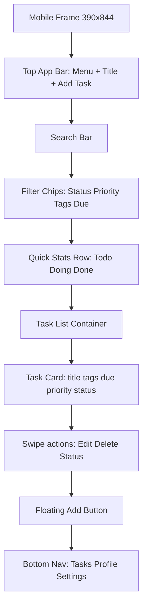
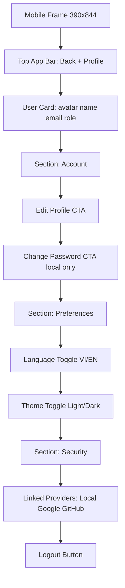

# Low-Fidelity Wireframe Prototype (Mobile-First 390x844)

## Pop Art Design System (Detailed)

### 0) Project Identity
- Project title: To-Do Pop
- Project style direction: Pop Art inspired by mass media, comic books, and advertising posters.
- Primary platform target: mobile-first (390x844), then responsive upscale to tablet/desktop.

### 1) Visual Theme & Atmosphere
- Mood: loud, playful, high-energy, optimistic, and action-oriented.
- Density: medium density UI with bold visual anchors, clear hierarchy, and fast scan patterns.
- Aesthetic philosophy: “Every action looks like a comic panel moment” while keeping task management efficient.
- UX intention: grab attention instantly, then guide users through clear, simple decision paths.

### 2) Color Palette & Functional Roles
- Electric Hero Red (#FF2D55): primary CTA, urgent actions, high-priority task markers.
- Comic Sun Yellow (#FFD60A): highlights, badges, active tab indicators, attention chips.
- Pop Cyan Blast (#00C2FF): secondary CTA, links, hover/focus accents.
- Ink Black Outline (#111111): outlines, icon strokes, heading text, comic border language.
- Paper White Base (#FFFDF7): primary background for readability and contrast.
- Bubble Pink Accent (#FF77B7): optional decorative chips, playful status highlights.
- Success Lime Punch (#7DDE2B): done/success confirmations.
- Alert Orange Burst (#FF8A00): warning states and recoverable errors.

### 3) Typography Rules
- Display headings: comic-impact style (e.g., Bangers/Anton-like tone), uppercase emphasis for page titles.
- Body text: rounded geometric sans for legibility in Vietnamese and English.
- Scale:
  - H1: 28–32px mobile, heavy weight.
  - H2: 20–24px mobile, bold weight.
  - Body: 14–16px, regular/medium.
  - Caption: 12–13px for metadata.
- Letter spacing:
  - Tight for body, slightly expanded for hero headings and badges.

### 4) Geometry & Shape Language
- Buttons: pill-like or strongly rounded rectangles with thick black outline.
- Cards: medium rounded corners, clear border, high-contrast edge.
- Inputs: rounded rectangles, visible 2–3px border, explicit focus ring.
- Chips/tags: capsule pills with high-contrast fill + border.
- Modals: framed like “comic panels” with bold header strip.

### 5) Depth & Elevation
- Shadows: offset comic shadow style (hard edge, short distance), not soft blur-heavy material shadows.
- Layering: foreground components use outline + offset shadow to “pop” above base.
- Priority cues:
  - High priority: stronger border + red/yellow combination.
  - Secondary content: lighter fill but maintain black outline.

### 6) Layout Principles
- Mobile first:
  - Horizontal padding: 16px.
  - Vertical rhythm: 8px base spacing unit.
  - Section gaps: 16–24px.
- Information flow:
  - top summary → filters → list/action surface.
  - one dominant action per viewport area.
- Responsive behavior:
  - mobile: single-column stacked panels.
  - tablet+: split summary/action regions and increase scan density.

### 7) Motion & Interaction Language
- Transitions: fast (150–220ms), snappy easing.
- Micro-interactions:
  - CTA press: slight scale down + shadow offset reduction.
  - Card hover/tap: subtle lift and border emphasis.
  - Status change: quick badge flash + toast confirmation.
- Realtime feedback:
  - silent list refresh with compact “Updated” toast.
  - reconnect triggers visible sync indicator.

### 8) Accessibility Guardrails
- Maintain WCAG contrast for text on saturated fills.
- Minimum touch target: 44x44.
- Always-visible focus indicators on keyboard navigation.
- Do not encode status by color only; pair with icon/label.

---

## 1) Auth (Login/Register)

```mermaid
flowchart TB
  A[Mobile Frame 390x844] --> B[Top: Logo + Language Toggle VI/EN]
  B --> C[Segmented Tabs: Đăng nhập | Đăng ký]
  C --> D[Email Input]
  D --> E[Password Input]
  E --> F[Remember me + Forgot password]
  F --> G[Primary CTA]
  G --> H[Divider: hoặc]
  H --> I[OAuth Google Button]
  I --> J[OAuth GitHub Button]
  J --> K[Helper text / inline errors]
  K --> L[Bottom link switch mode]
```

### Must-have components
- Header brand area with language switch
- Auth tabs
- Form inputs with validation state
- OAuth buttons (Google/GitHub)
- Warning toast area (for auto-link notice)

### Detailed low-fi behavior
- Login flow states:
  - idle, validation error, submitting, success redirect.
  - same-email OAuth link: verification step then warning toast.
- Register form fields:
  - display name, email, password, confirm password.
- Validation copy style:
  - short, direct, bilingual-ready keys.
- Visual cues:
  - active tab uses yellow underline + black border emphasis.
  - primary button uses red fill and strong comic shadow.

---

## 2) Task Board/List



### Must-have components
- Search + filters
- Status summary counters
- Task cards with quick actions
- Add task FAB
- Empty/loading/error states

### Detailed low-fi behavior
- Filter logic:
  - status, priority, tags, due-date range, keyword search.
- Task card anatomy:
  - title row, metadata row, status badge, priority badge, due-date, tag chips, overflow menu.
- Reorder behavior:
  - drag within status column; persist `orderIndex` per column.
- Soft delete behavior:
  - delete opens confirm dialog; success toast includes restore shortcut.
- Overdue visualization:
  - computed overdue gets orange burst indicator.
  - explicit overdue shows labeled badge “Overdue (manual)”.

---

## 3) Profile/Settings



### Must-have components
- User identity summary
- Language and theme settings
- Linked login providers visibility
- Secure logout action

### Detailed low-fi behavior
- Provider management panel:
  - show linked/unlinked state for Local, Google, GitHub.
  - allow link action for unlinked providers.
- Preferences persistence:
  - language and theme saved immediately after toggle.
- Security surface:
  - session list (device + last active) planned extension hook.

---

## 4) Admin Dashboard

```mermaid
flowchart TB
  A[Mobile Frame 390x844] --> B[Top App Bar: Admin + Alerts]
  B --> C[Stats Cards: Todo Doing Done Total Users]
  C --> D[Tabs: Users | Tasks | Audit Logs]
  D --> E[Search + Filter Row]
  E --> F[Users Table/List]
  F --> G[Actions: Add Edit Soft Delete Restore]
  G --> H[Tasks Moderation List]
  H --> I[Actions: Edit Soft Delete Restore]
  I --> J[Audit Log Timeline]
```

### Must-have components
- Status analytics cards
- User CRUD (no hard delete)
- Task moderation controls
- Audit log feed
- Trash/restore view (7-day window)

### Detailed low-fi behavior
- Users tab:
  - add/edit user modal, disable/enable user, soft delete with reason.
- Tasks tab:
  - moderation actions, restore queue, filters by owner/status/deletion source.
- Audit tab:
  - timeline cards with actor, action, target, timestamp, before/after summary.
- Stats cards:
  - Todo/Doing/Done/Overdue totals + user totals (active/disabled).

### Admin IA split (required pages)
- Admin Home: KPI overview + quick actions.
- Admin Analytics: trends and distribution charts.
- Admin Users: list management.
- Admin Add User: dedicated create form page.
- Admin User Filter: advanced user filter controls.
- Admin Tasks Moderation: task governance list.
- Admin Task Filter: advanced moderation filter controls.
- Admin Audit Logs: searchable event timeline.
- Admin Settings: policy and operational preferences.
- Admin Trash: restore deleted users/tasks within 7 days.

---

## Interaction Notes
- Realtime: on every socket event => full refetch with debounce.
- Reconnect: immediate refetch then resume live stream.
- Deletion: all admin delete actions are soft delete with restore.
- OAuth same-email: auto-link after verification + warning toast.

---

## Prompt Upgrade: Build All Pages & Components

Use this as the next implementation prompt baseline.

### Global app shell components (required)
- `AppShell` (header, optional side nav, bottom mobile nav)
- `RouteGuard` (auth + role-based admin gate)
- `LanguageSwitcher` (vi/en)
- `ThemeToggle` (light/dark)
- `ToastHost` (success/warning/error)
- `ConfirmDialog` (soft-delete and dangerous actions)
- `LoadingState`, `EmptyState`, `ErrorState`

### User-centered sitemap (expanded)
- Public: Splash, Login, Register, OAuth Linking Verification, Forgot Password.
- User area: Task Home, Task Board, Task Filter, Task Search Result, Task Detail, Add Task Modal, Edit Task Modal, Delete Confirm Modal, Profile, Settings, Linked Providers Modal, Session Devices Modal.
- Admin area: Admin Home, Admin Analytics, Admin Users, Admin Add User, Admin Edit User Modal, Admin User Filter, Admin Task Moderation, Admin Task Filter, Admin Audit Logs, Admin Settings, Admin Trash.

### Auth page components
- `AuthPageLayout`
- `AuthTabs` (`LoginForm`, `RegisterForm`)
- `OAuthButtons` (`GoogleButton`, `GitHubButton`)
- `LinkingWarningToast`
- `ForgotPasswordLink`

### Task page components
- `TaskPageHeader`
- `TaskSearchBar`
- `TaskFilterChips` (status, priority, tags, due)
- `TaskStatsRow` (todo, doing, done, overdue)
- `TaskList`
- `TaskCard`
- `TaskActionsMenu` (edit, soft-delete, status change)
- `TaskFormModal` (create/edit)
- `TaskTrashPanel` (restore own tasks)

### Profile/settings page components
- `ProfileSummaryCard`
- `ProfileEditForm`
- `PasswordChangeForm` (local provider only)
- `PreferencePanel` (language/theme)
- `LinkedProvidersPanel`
- `LogoutButton`

### Admin dashboard components
- `AdminStatsCards` (task counts + user counts)
- `AdminTabs` (`UsersTab`, `TasksTab`, `AuditLogsTab`)
- `AdminUserTable`
- `AdminUserFormModal` (add/edit user)
- `AdminTaskModerationList`
- `AdminAuditTimeline`
- `AdminTrashPanel` (restore within 7 days)

### Data/API contracts to wire
- Auth APIs: login/register/refresh/logout, OAuth callbacks, account-link verification.
- Task APIs: CRUD, search/filter/sort/paginate, reorder per status column, restore.
- Admin APIs: user CRUD, user status updates, task moderation, stats, audit logs.
- Realtime: socket event listener that always triggers full refetch (debounced) + reconnect refetch.

### Collection mapping reference
- `users` => profile/settings, auth identity, provider linking, role/status.
- `tasks` => board/list cards, filters, reorder, soft delete/restore.
- `refresh_sessions` => device/session security handling.
- `audit_logs` => admin audit timeline and governance visibility.

### Delivery order (implementation plan)
1. Global app shell + routing + auth guard.
2. Auth feature (forms + OAuth + linking warning UX).
3. Task feature (list, board, search, filters, add/edit modals, stats, reorder, trash restore).
4. Profile/settings feature.
5. Admin feature split pages (home, analytics, users, add user, filters, moderation, audit, settings, trash).
6. Realtime subscriptions and reconnect behavior.
7. Cross-feature polish: i18n strings, theme parity, accessibility, responsive QA.

---

## Stitch-ready prompt artifact
- Use this full prompt package to generate all screens in Stitch:
  - [wireframes/stitch-ready-prompts.md](wireframes/stitch-ready-prompts.md)

### Design QA checklist (Pop Art-specific)
- Every primary action is visually dominant (red/yellow hierarchy).
- Outlines are consistent in thickness across buttons/cards/inputs.
- Shadow style is comic-offset, not default soft material style.
- Typography keeps comic personality without harming readability.
- Vietnamese strings fit without overflow at mobile width 390.
- Light and dark themes both preserve Pop Art identity.
